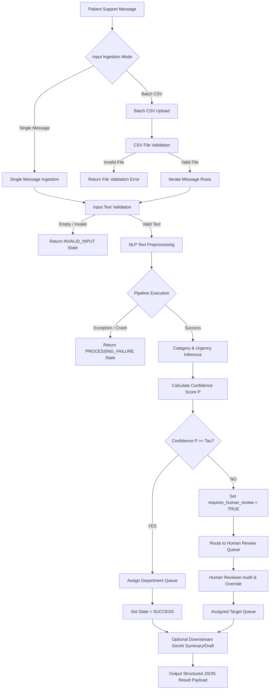

# Section 3 — System Actors, User Roles & End-to-End Workflows

**Project Title:** Patient Message Triage & Urgency Classifier (PS-1)  
**Track:** Healthcare & HealthTech  
**Author:** Implementation Engineer  
**Supervisor:** Senior Developer  
**Status:** System Design & Workflow Specification (Approved)  
**Authoritative References:**  
- [SECTION1_PROBLEM_STATEMENT.md](file:///C:/Users/hp/.gemini/antigravity/scratch/patient-message-triage/SECTION1_PROBLEM_STATEMENT.md)  
- [SECTION2_FUNCTIONAL_REQUIREMENTS.md](file:///C:/Users/hp/.gemini/antigravity/scratch/patient-message-triage/SECTION2_FUNCTIONAL_REQUIREMENTS.md)  

---

## 1. Executive Summary & Objective

### 1.1 Objective
This document defines **Section 3 — System Actors, User Roles & End-to-End Workflows** for **PS-1 — Patient Message Triage & Urgency Classifier**. It specifies who interacts with the system, the operational responsibilities of each human actor, the conceptual role of system components, and the end-to-end procedural workflows governing patient message processing.

### 1.2 Authoritative Alignment
This specification builds directly on Section 1 (Problem Definition) and Section 2 (Functional Requirements). All workflow rules preserve previously confirmed constraints, maintain non-clinical safety boundaries, and keep unresolved decisions tagged as `[TBD]`.

---

## 2. System Actors & User Roles

To maintain strict architectural clarity, human actors are explicitly distinguished from automated system components.

```
                                  +-----------------------+
                                  |     PATIENT           |
                                  | (Message Originator)  |
                                  +-----------------------+
                                              |
                                              v (Submits inquiry via external channel)
+-----------------------------------------------------------------------------------+
|                            APPLICATION USERS                                      |
|                                                                                   |
|  +-----------------------+   +-----------------------+   +---------------------+  |
|  | Operations / Triage   |   | Human Reviewer        |   | Department Staff    |  |
|  | Staff (Primary User)  |   | (Triage Escalation)   |   | (Queue Processor)   |  |
|  +-----------------------+   +-----------------------+   +---------------------+  |
|                                                                                   |
|  +-----------------------------------------------------------------------------+  |
|  | System Administrator [CONCEPTUAL / FUTURE]                                  |  |
|  +-----------------------------------------------------------------------------+  |
+-----------------------------------------------------------------------------------+
```

### 2.1 Human Actors

#### 1. Patient (Message Originator) `[CONFIRMED]`
- **Role:** The individual initiating the support communication.
- **Application User Status:** **NOT AN APPLICATION USER.**
- **Scope Boundary:** PS-1 does **NOT** build patient portals, patient accounts, booking engines, patient-facing chatbots, or medical record viewports. The patient is solely the external source of the message text ingested by the system.

#### 2. Operations / Triage Staff (Primary Application User) `[CONFIRMED]`
- **Role:** Administrative healthcare personnel responsible for ingesting, monitoring, and routing patient communications.
- **Responsibilities:**
  - Enter single patient-support messages into the system.
  - Upload batch CSV files containing historical or incoming message feeds.
  - Review model-generated predictions (Category, Urgency, Confidence, Queue Assignment).
  - Identify low-confidence flags (`requires_human_review = TRUE`).
  - Dispatch processed messages to designated operational workflows.

#### 3. Human Reviewer (Operational Triage Specialist) `[CONFIRMED]`
- **Role:** Operational supervisor or experienced intake staff tasked with auditing uncertain predictions.
- **Responsibilities:**
  - Monitor the **Human Review Queue**.
  - Inspect low-confidence predictions alongside original message text and feature explanations.
  - Make final operational determinations for ambiguous messages.
  - *Boundary:* The reviewer makes **operational administrative decisions**, not clinical diagnoses.

#### 4. Department / Queue Staff `[CONCEPTUAL]`
- **Role:** Operational teams assigned to functional queues (Front Desk, Billing, Records, Tech Support, Medication Refill).
- **Responsibilities:**
  - Access messages assigned to their specific departmental queue.
  - Fulfill administrative patient requests according to organizational procedures.

#### 5. System Administrator `[CONCEPTUAL / FUTURE]`
- **Role:** IT/System supervisor overseeing system health and configuration.
- **Responsibilities:**
  - Manage system routing rules, operational confidence thresholds $\tau$, model versions, and audit logs.
  - *Status:* Conceptual future role; excluded from MVP implementation.

---

### 2.2 System Components (Non-Human Actors)

Automated system components process data deterministically across the pipeline:

| System Component | Conceptual Responsibility | Decision Authority |
|---|---|---|
| **Input Validation Engine** | Enforces structural, type, and null-check rules on incoming messages/CSVs | Technical Pass/Fail rejection |
| **NLP Text Processing Pipeline** | Normalizes, tokenizes, and sanitizes raw text into model-compatible vectors | Deterministic transformation |
| **Category Classifier** | Predicts the multi-class operational topic of the inquiry | Statistical inference |
| **Urgency Classifier** | Assesses operational priority and turnaround requirement | Statistical inference |
| **Confidence Evaluator** | Computes normalized certainty score $P$ and compares against threshold $\tau$ | Quantitative evaluation |
| **Routing Engine** | Maps `(Category, Urgency)` pairs to target department queues | Rule-based mapping (`[TBD]`) |
| **Explanation Engine** | Extracts feature keywords/attributions supporting predictions | Non-authoritative metadata |
| **Human Review Queue** | Holds low-confidence predictions ($P < \tau$) for operator audit | Operational holding area |
| **Optional Generative AI Layer** | Synthesizes short message summaries or draft response templates | Downstream non-authoritative helper |
| **Audit & Logging System** | Captures state transitions and triage decisions for operational monitoring | Non-decisional recorder |

---

## 3. End-to-End Operational Workflows

---

### 3.1 Primary Single-Message Workflow
This workflow governs real-time processing of an individual patient-support message.

```
 Operations / Triage Staff
           |
           v
 [Enter Patient Message]
           |
           v
 [Input Validation Engine]
           |
     < Valid Text? > --------------------------> (NO) ---> [Return INVALID_INPUT Payload]
           |
         (YES)
           v
 [NLP Text Processing Pipeline]
           |
           v
 [Category & Urgency Classifiers]
           |
           v
 [Compute Confidence Score P]
           |
           v
   < Is P >= Threshold Tau? >
     /                    \
  (YES)                   (NO)
   /                        \
  v                          v
[Department Routing]    [Set requires_human_review = TRUE]
  |                          |
  |                     [Route to Human Review Queue]
  \                          /
   +-----------+------------+
               |
               v
 [Format Structured JSON Payload]
               |
               v
 [Display Result to Staff / Queue]
```

#### Detailed Workflow Steps:
1. **Ingestion:** Operations Staff inputs raw message text + optional metadata.
2. **Validation:** Input Validation Engine checks for empty strings, nulls, or invalid data types. If invalid, the system halts processing and returns `INVALID_INPUT`.
3. **Processing:** Valid text passes to the NLP Processing Pipeline for normalization and vectorization.
4. **Inference:** Category and Urgency Classifiers generate class probability distributions.
5. **Confidence Evaluation:** Confidence Evaluator checks probability $P$ against threshold $\tau$.
6. **Routing / Escalation:**
   - If $P \ge \tau$, Routing Engine assigns target department queue (`SUCCESS`).
   - If $P < \tau$, system sets `requires_human_review = TRUE` and routes message to Human Review Queue (`LOW_CONFIDENCE`).
7. **Explanation & Output:** Explanation Engine appends feature highlights, and the system emits the complete structured payload to the staff interface.

---

### 3.2 Batch CSV Processing Workflow
This workflow governs bulk processing of multi-row CSV message feeds.

```
 Operations / Triage Staff
           |
           v
 [Upload Batch CSV File]
           |
           v
 [CSV Validation Engine]
           |
   < Valid CSV Header & File? > --------------> (NO) ---> [Return File Rejection Error]
           |
         (YES)
           v
 [Row-by-Row Pipeline Iteration]
           |
   +-------+-----------------------+
   |                               |
[Valid Message Row]        [Malformed / Empty Row]
   |                               |
[Execute Single-Message Engine]   [Record Row Error State]
   |                               |
[Assign Category, Urgency, Queue]  |
   |                               |
   +---------------+---------------+
                   |
                   v
 [Assemble Aggregated Batch Report]
                   |
                   v
 [Provide Row-Level Download & Review Feed]
```

#### Detailed Workflow Steps:
1. **Upload:** Operations Staff uploads a CSV file.
2. **File Validation:** Engine verifies CSV formatting, file non-emptiness, and presence of designated message column. Malformed files are rejected immediately.
3. **Row Processing Loop:**
   - The engine iterates through rows sequentially or in parallel batches.
   - Malformed rows are logged as `INVALID_INPUT` without halting execution.
   - Valid rows pass through the standard single-message classification pipeline.
4. **Traceability Preservation:** Row indices (`row_id`) remain strictly correlated with input rows.
5. **Batch Assembly:** The system aggregates row results, computes summary metrics (Total Processed, Auto-Routed, Human Review Required, Failed Rows), and delivers the structured output.

---

### 3.3 Low-Confidence & Human Review Workflow
This workflow handles uncertain predictions requiring human operator verification.

```
   [Classifier Prediction]
              |
              v
 [Confidence P < Threshold Tau]
              |
              v
 [Set requires_human_review = TRUE]
              |
              v
 [Dispatch to Human Review Queue]
              |
              v
 [Human Reviewer Inspects Item]
  - Original Message Text
  - Model Category & Urgency
  - Confidence Score P
  - Keyword Explanations
              |
              v
 < Human Reviewer Action >
  +-----------+-----------+
  |                       |
[Approve / Confirm]    [Override / Reassign]
  |                       |
  +-----------+-----------+
              |
              v
 [Route to Final Department Queue]
              |
              v
 [Mark Record State = COMPLETED]
```

---

### 3.4 Processing Failure Workflow
This workflow governs unexpected system pipeline failures.

```
 [Valid Message Input]
           |
           v
 [Execution Failure in Preprocessing / Inference]
           |
           v
 [Intercept Exception & Prevent System Crash]
           |
           v
 [Set System State = PROCESSING_FAILURE]
           |
           v
 [Log Failure Event for System Admin]
           |
           v
 [Return Safe Error Response (No Hallucinated Labels)]
```

---

### 3.5 Optional Downstream Generative AI Workflow
If optional GenAI capabilities are enabled, they must operate strictly downstream of the ML classifier.

```
           [Patient Message Text]
                     |
                     v
   [Structured Supervised ML Classifier]
                     |
     (Assigns Category, Urgency, Queue)
                     |
                     v
  +------------------+------------------+
  |                                     |
  v                                     v
[Structured Result]          [Downstream GenAI Layer]
  |                                     |
  |                      < Permitted Responsibilities >
  |                      - Generate 1-Sentence Summary
  |                      - Generate Draft Acknowledgement
  |                                     |
  \                                     /
   +-----------------+-----------------+
                     |
                     v
   [Combined Staff Dashboard Payload]
```

*Strict Rule:* GenAI outputs are non-authoritative metadata and **cannot** alter classification, urgency, confidence, or routing decisions.

---

## 4. End-to-End System Integration Flowchart



---

## 5. Responsibility Matrices

### 5.1 Actor Responsibility Matrix

| Actor | Interaction Type | Operational Responsibility | MVP Status | Requirement Status |
|---|---|---|---|---|
| **Patient** | External Originator | Sends patient-support message via clinic portal/SMS | Out of Scope | `[CONFIRMED]` |
| **Operations / Triage Staff** | Direct Application User | Ingests single messages, uploads batch CSVs, reviews predictions | Mandatory MVP | `[CONFIRMED]` |
| **Department / Queue Staff** | Downstream Recipient | Receives routed administrative inquiries per queue | Conceptual MVP | `[CONCEPTUAL]` |
| **Human Reviewer** | Direct Application User | Audits low-confidence predictions ($P < \tau$), approves/overrides routing | Mandatory MVP | `[CONFIRMED]` |
| **System Administrator** | Admin Interface User | Manages thresholds, routing rules, user accounts, model versions | Future | `[TBD — Architecture]` |

---

### 5.2 System Component Responsibility Matrix

| Component | Responsibility | Input Data | Output Data | Decision Authority |
|---|---|---|---|---|
| **Input Validation** | Verifies data structure, types, non-nulls | Raw Message / CSV | Validated Text / Error | Rejection Authority |
| **NLP Preprocessing** | Cleans, normalizes, vectorizes text | Validated Text | Model Vector | Deterministic |
| **Category Classifier** | Predicts operational topic category | Model Vector | Category Probabilities | Statistical Inference |
| **Urgency Classifier** | Evaluates operational priority | Model Vector | Urgency Probabilities | Statistical Inference |
| **Confidence Evaluator**| Evaluates probability against threshold $\tau$ | Probability Vector | Confidence Score & Flag | Escalation Trigger |
| **Routing Engine** | Maps `(Category, Urgency)` to Queue | Category + Urgency | Target Queue Name | Deterministic Lookup |
| **Explanation Engine**| Extracts feature keyword highlights | Model Weights + Text | Keyword Attributions | Informational Only |
| **Human Review Queue**| Holds low-confidence cases | Unresolved Records | Audited Records | Holding Buffer |
| **Optional GenAI** | Drafts summaries & response templates | Message + Prediction | Summary / Draft Text | Non-Authoritative |
| **Logging & Audit** | Records execution history | Pipeline Events | Operational Logs | Audit Recorder |

---

## 6. Conceptual Message State Machine

The life cycle of a message within the system follows a formal state transition model:

```
+--------------+        Validation Failure       +------------------+
|   RECEIVED   | ------------------------------> |  INVALID_INPUT   |
+--------------+                                 +------------------+
       |
       | Validation Success
       v
+--------------+        Pipeline Exception       +------------------+
|  VALIDATED   | ------------------------------> |PROCESSING_FAILURE|
+--------------+                                 +------------------+
       |
       | Preprocessing Success
       v
+--------------+
|  PROCESSING  |
+--------------+
       |
       | Inference Complete
       v
+--------------+
|  PREDICTED   |
+--------------+
       |
       +------------------------------------+
       |                                    |
   P >= Tau                              P < Tau
       |                                    |
       v                                    v
+--------------+                     +------------------+
|    ROUTED    |                     |  LOW_CONFIDENCE  |
+--------------+                     +------------------+
       |                                    |
       |                                    v
       |                             +------------------+
       |                             |   HUMAN_REVIEW   |
       |                             +------------------+
       |                                    |
       |                                    | Review Completed
       v                                    v
+---------------------------------------------------------------+
|                           COMPLETED                           |
+---------------------------------------------------------------+
```

*Status:* State Machine model is conceptual (`[CONCEPTUAL]`); exact state persistence schema is deferred to `[TBD — Architecture/API Design]`.

---

## 7. Security, Privacy & Safety Boundaries

### 7.1 Security & Privacy Bounds `[TBD — Security Architecture]`
- Patient-support messages contain sensitive text. System architecture must enforce minimal data exposure.
- Long-term storage of unprotected Protected Health Information (PHI) in operational logs is prohibited.
- Production deployment requires role-based authentication and queue-level authorization.

### 7.2 Healthcare Safety Bounds `[CONFIRMED]`
- **Non-Clinical Router Boundary:** The system strictly automates administrative and operational triage.
- **Prohibited Capabilities:** The system does **NOT** perform medical diagnosis, recommend treatments, prescribe medication, or substitute for clinical triage (e.g., ESI).
- **Human Safeguard Guarantee:** All ambiguous or medically sensitive inquiries failing confidence thresholds are mandatorily directed to human operators.

---

## 8. Requirements Traceability Matrix (Sections 1 $\to$ 2 $\to$ 3)

| Section 1 Concept | Section 2 Functional Req | Section 3 Actor / Workflow | Target Engineering Phase |
|---|---|---|---|
| Single & Batch Ingestion | `FR-01` | Operations Staff (Single & Batch Workflows) | Backend API Engineering |
| Message Validation | `FR-02` | Input Validation Engine (`INVALID_INPUT` State) | Backend Validation Layer |
| Text Processing | `FR-03` | NLP Preprocessing Component | ML Pipeline Engineering |
| Category Classification | `FR-04` | Category Classifier | ML Engineering |
| Urgency Assessment | `FR-05` | Urgency Classifier | ML Engineering |
| Confidence Evaluation | `FR-06`, `FR-07` | Confidence Evaluator & Human Reviewer | ML & Workflow Engineering |
| Department Queue Routing| `FR-08` | Routing Engine & Department Queue Staff | Architecture & Logic Layer |
| Output JSON Payload | `FR-09` | Output Format in Single/Batch Workflows | API Contract Engineering |
| Feature Explanation | `FR-10` | Explanation Engine | ML Interpretability |
| Healthcare Safety | `FR-16` | Healthcare Safety Boundaries in all workflows | Core System Guardrails |

---

## 9. Open Decisions (`[TBD]` Catalog)

The following 10 decisions remain unresolved and are explicitly deferred to future design phases:

1. **User Role Permissions Matrix:** Granular RBAC definitions for Operations Staff vs Reviewers (`[TBD — Security]`)..
2. **Final Department Queue Structure:** Final set of operational queues (`[TBD — Operations]`)..
3. **Deterministic Routing Lookup Matrix:** Exact mapping rules `(Category, Urgency) -> Department` (`[TBD — Architecture]`)..
4. **Human Review Action Set:** Defining whether reviewers approve, reassign, or edit predictions (`[TBD — UI/Workflow]`)..
5. **Numerical Confidence Threshold ($\tau$):** Exact threshold value (e.g., $0.75$) (`[TBD — ML Experiments]`)..
6. **State Machine Database Persistence Schema:** Table structure for tracking state transitions (`[TBD — Database Design]`)..
7. **Authentication & Authorization Protocol:** JWT/OAuth2 mechanisms for staff logins (`[TBD — Security]`)..
8. **Patient Portal Integration Boundary:** Protocol for receiving web/SMS webhooks (`[TBD — System Architecture]`)..
9. **PHI Anonymization & Data Privacy Pipeline:** Data masking rules for audit logs (`[TBD — Security]`)..
10. **Downstream GenAI Integration Architecture:** LLM framework, prompting, and local vs cloud API choices (`[TBD — GenAI Architecture]`)..

---

## 10. Scope & Deferral Control

### 10.1 Section 3 Scope
Section 3 is strictly limited to defining system actors, human roles, component roles, and end-to-end operational workflows.

### 10.2 Strictly Deferred Items
The following engineering tasks remain strictly prohibited during Section 3:
- Application backend code (FastAPI/Flask).
- Machine learning model development or synthetic data generation.
- Database schema creation or SQL scripts.
- Frontend UI development (React/Vite).
- Cloud/Docker infrastructure configuration.

---

*Document complete and approved for Section 3 — System Actors, User Roles & End-to-End Workflows.*
