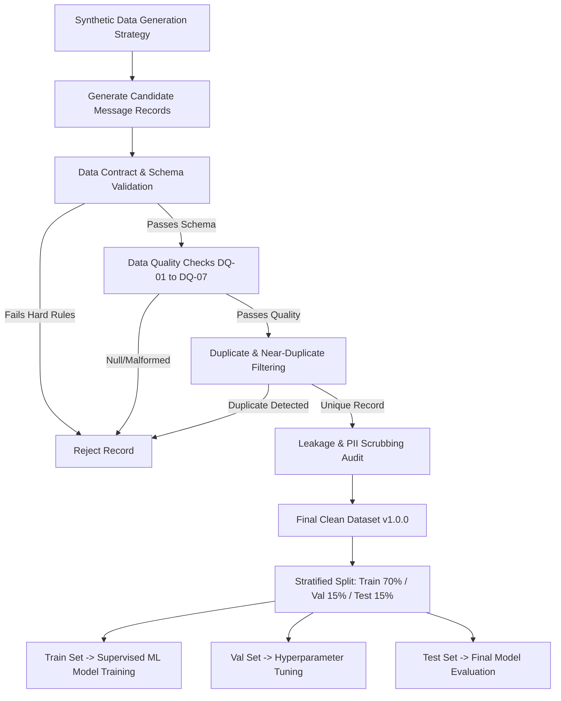

# Section 4 — Data Strategy, Data Contract & Dataset Design

**Project Title:** Patient Message Triage & Urgency Classifier (PS-1)  
**Track:** Healthcare & HealthTech  
**Author:** Implementation Engineer  
**Supervisor:** Senior Developer  
**Status:** Data Specification & Contract (Approved)  
**Authoritative References:**  
- [SECTION1_PROBLEM_STATEMENT.md](file:///C:/Users/hp/.gemini/antigravity/scratch/patient-message-triage/SECTION1_PROBLEM_STATEMENT.md)  
- [SECTION2_FUNCTIONAL_REQUIREMENTS.md](file:///C:/Users/hp/.gemini/antigravity/scratch/patient-message-triage/SECTION2_FUNCTIONAL_REQUIREMENTS.md)  
- [SECTION3_ACTORS_ROLES_WORKFLOWS.md](file:///C:/Users/hp/.gemini/antigravity/scratch/patient-message-triage/SECTION3_ACTORS_ROLES_WORKFLOWS.md)  

---

## 1. Executive Summary & Objective

### 1.1 Objective
This document formalizes **Section 4 — Data Strategy, Data Contract & Dataset Design** for **PS-1 — Patient Message Triage & Urgency Classifier**. It defines the canonical data schema, field definitions, category/urgency label strategies, synthetic data generation principles, data quality rules, duplicate/leakage prevention policies, privacy rules, and data contract validation logic.

### 1.2 Authoritative Context & Scope Boundary
This document operates strictly as a **design specification**. In alignment with project rules, **NO actual dataset was generated, NO synthetic generator script was executed, and NO ML model training was performed.** All open decisions from Sections 1–3 are preserved and marked `[TBD]` unless analyzed and recommended under engineering analysis.

---

## 2. Data Source Strategy

PS-1 permits two main data sourcing avenues:

| Source Option | Advantages | Disadvantages / Risks | Recommendation & Status |
|---|---|---|---|
| **Option A: Public Healthcare Dataset** | - Real-world linguistic variety<br>- Authentic patient phrasing | - Extremely rare public availability due to HIPAA/GDPR<br>- Misalignment with PS-1 operational queues | Evaluate as secondary benchmark if de-identified corpus exists (`[CONCEPTUAL]`). |
| **Option B: Synthetic Dataset Generation** | - Tailored specifically to PS-1 categories & queues<br>- Zero real-world PII leakage risk<br>- Controlled class balance | - Risk of template repetition & artificial patterns<br>- Requires strict generation rules | **Primary Recommended Strategy** (`[TBD — Data Strategy]`, subject to senior developer approval). |

---

## 3. Data Purpose Segregation

To maintain data hygiene and prevent evaluation bias, data usage is segregated into five explicit functional tiers:

1. **Training Dataset:** Used exclusively by supervised ML algorithms to learn classification decision boundaries.
2. **Validation Dataset:** Used for hyperparameter tuning, vectorizer optimization, and model selection.
3. **Test Dataset:** Held out strictly for final, un-biased model performance evaluation (never exposed during training).
4. **Operational Data Payload:** Input data submitted by end users during live inference (single message or batch CSV).
5. **Dataset Metadata:** System tracking attributes (versioning, timestamps, source identifiers) strictly isolated from feature matrices.

---

## 4. Canonical Data Contract & Schema

The canonical schema represents the standardized data structure governing both dataset generation and API payload exchange.

### 4.1 Canonical Field Specification

| Field Name | Conceptual Type | Required | Purpose | ML Pipeline Role | Allowed Values / Format | Privacy Level | Status |
|---|---|---|---|---|---|---|---|
| `message_id` | Identifier | YES | Unique record key | Metadata (Excluded) | UUID / `MSG-XXXXXX` | Non-PII | `[CONFIRMED]` |
| `message_text` | String / Text | YES | Raw patient message | **PRIMARY FEATURE** | Non-empty text string | Masked/Synthetic | `[CONFIRMED]` |
| `category` | Categorical | YES | Operational topic label | **TARGET LABEL 1** | See Section 5 schema | Non-PII | `[CONFIRMED]` |
| `urgency` | Categorical | YES | Turnaround priority label | **TARGET LABEL 2** | See Section 6 schema | Non-PII | `[CONCEPTUAL / TBD]` |
| `department` | Categorical | OPTIONAL | Target operational queue | Derived / Routing Target | See Section 8 schema | Non-PII | `[CONCEPTUAL / TBD]` |
| `timestamp` | Datetime | OPTIONAL | Submission timestamp | Metadata (Excluded) | ISO 8601 (`YYYY-MM-DDTHH:MM:SSZ`) | Non-PII | `[CONFIRMED]` |
| `generation_source` | String | OPTIONAL | Synthetic provenance tag | Metadata (Excluded) | e.g., `Synthetic_v1` | Non-PII | `[CONCEPTUAL]` |
| `dataset_version` | String | OPTIONAL | Schema version tag | Metadata (Excluded) | e.g., `v1.0.0` | Non-PII | `[CONCEPTUAL]` |

---

## 5. Category Label Strategy

The request category represents the primary operational topic of the inquiry.

### 5.1 Confirmed PS-1 Operational Categories
The following 6 operational categories are established by the official problem statement:
1. **`Appointment`**: Scheduling, rescheduling, clinic locations, visit cancellations.
2. **`Billing`**: Invoices, insurance coverage, co-pays, payment receipts, financial aid.
3. **`Medication Refill`**: Rx renewal requests, dosage checks, pharmacy transfer/fulfillment.
4. **`Report Request`**: Diagnostic lab reports, imaging results, physician notes, medical records.
5. **`Technical Issue`**: Patient portal login errors, app crashes, password resets, digital form glitches.
6. **`Urgent Review`**: Rapid administrative escalation requests requiring fast intake.

### 5.2 Schema Governance & Fallback Handling
- *Fallback Category:* The inclusion of an `Other` or `General Inquiry` category is tagged as `[TBD]`. If introduced, it must be handled carefully to prevent it from becoming a catch-all bucket during training.

---

## 6. Urgency Label Strategy & Tradeoff Analysis

Operational urgency defines how quickly staff must process the message.

### 6.1 Tradeoff Analysis of Urgency Schemas

| Scheme Option | Allowed Labels | Advantages | Disadvantages | Recommendation |
|---|---|---|---|---|
| **Option 1: Binary Urgency** | `Routine`, `Urgent` | - High inter-annotator agreement<br>- Clear operational boundary<br>- Easier class balance | - Less granular triage prioritization | **Recommended for MVP** (`[TBD — Data/ML Design]`) |
| **Option 2: Multi-Class Urgency** | `Low`, `Medium`, `High`, `Urgent` | - Fine-grained queue priority | - Harder to distinguish in text<br>- Higher risk of label noise | Consider for post-MVP refinement (`[CONCEPTUAL]`) |

---

## 7. Category vs Urgency Relationship & Label Disambiguation

A key design challenge in PS-1 is the potential semantic overlap between the `Urgent Review` category and the `urgency` dimension.

### 7.1 Structural Relationship Alternatives

```text
Design A: Fully Independent Dimensions (Recommended)
  Category = Appointment | Billing | Refill | Report | Technical | Urgent Review
  Urgency  = Routine | Urgent
  (Allows: Category=Appointment + Urgency=Urgent)

Design B: Hierarchical / Coupled Dimensions
  Category = Appointment | Billing | Refill | Report | Technical
  Urgency  = Routine | Urgent (where Urgent automatically maps to Urgent Review Queue)
```

### 7.2 Disambiguation Rules
- Messages assigned to the `Urgent Review` category should, by definition, have `urgency = Urgent`.
- However, messages in administrative categories (e.g., `Appointment` or `Medication Refill`) can also have `urgency = Urgent` (e.g., *"My appointment is tomorrow morning and I need to cancel immediately due to a family emergency"*).
- *Status:* `[TBD — Data/ML Design]` — Final structural coupling will be confirmed during ML Pipeline architecture.

---

## 8. Department Operational Routing Field

The `department` field represents the destination operational queue.

### 8.1 Functional Relationship
- `department` is **NOT an independent ML target label** during core text classification.
- `department` is a **derived operational attribute** generated downstream by combining predicted `Category` and `Urgency`:
  $$\text{Department Queue} = f(\text{Category}, \text{Urgency})$$
- *Status:* `[TBD — Architecture/ML Design]` — Exact lookup matrix mapping `(Category, Urgency) -> Queue` will be established during system design.

---

## 9. Feature / Label Separation & Leakage Prevention

To prevent catastrophic data leakage during model training, strict feature isolation rules are enforced.

```
+-------------------------------------------------------------------------+
|                          RAW DATA RECORD                                |
| (message_id, message_text, category, urgency, department, timestamp)   |
+-------------------------------------------------------------------------+
                                     |
           +-------------------------+-------------------------+
           |                                                   |
           v                                                   v
+------------------------------------+               +------------------------------------+
|       FEATURE MATRIX (X)           |               |        TARGET LABELS (Y)           |
|                                    |               |                                    |
| - message_text (Cleaned Text)      |               | - category  (Target Label 1)       |
|                                    |               | - urgency   (Target Label 2)       |
| EXCLUDED:                          |               |                                    |
| - message_id                       |               | EXCLUDED FROM FEATURES:            |
| - category                         |               | - department (Derived Output)      |
| - urgency                          |               | - timestamp                        |
| - department                       |               |                                    |
| - timestamp                        |               |                                    |
+------------------------------------+               +------------------------------------+
```

### 9.1 Data Leakage Prevention Directives
1. **Target Leakage:** Target labels (`category`, `urgency`) MUST NOT be present in feature matrix $X$.
2. **Routing Leakage:** `department` MUST NOT be used as a feature, as it is derived directly from target labels.
3. **Metadata Leakage:** `timestamp` and `message_id` MUST NOT be exposed to vectorizers to prevent models from learning temporal or sequential artifacts.
4. **Train/Test Contamination:** Identical or near-duplicate messages MUST NOT span across Train and Test splits.

---

## 10. Dataset Size & Class-Balance Strategy

### 10.1 Dataset Size Range Analysis
The problem statement recommends a initial range of **300–1,000 labeled messages**:

- **300 Messages:** ~50 examples per category. Suitable for lightweight baseline validation (TF-IDF + Naive Bayes).
- **600 Messages:** ~100 examples per category. Better feature coverage and cross-validation stability.
- **1,000 Messages:** ~166 examples per category. Ideal target size for robust multi-class NLP classifier training.
- *Status:* `[TBD — Data Generation Phase]` — Target size recommended at **600–1,000 messages**.

### 10.2 Class-Balance Targets
- **Category Balance:** Uniform distribution (~16.6% per category across the 6 confirmed categories).
- **Urgency Balance:** Target ratio of ~70% `Routine` to ~30% `Urgent` (reflecting typical operational distribution while ensuring adequate urgent training instances).

---

## 11. Synthetic Data Generation Principles

Synthetic patient messages must reflect real-world operational communication diversity while avoiding artificial pattern artifacts.

### 11.1 Diversity Guidelines
- **Linguistic Variation:** Mix formal medical queries, informal patient phrasing, slang, typos, and abbreviations.
- **Message Length Diversity:** Include short single-phrase queries (e.g., *"Refill my blood pressure prescription"*) and long multi-sentence explanations.
- **No Template Substitution Artifacts:** Generation MUST NOT rely on simple string replacement templates (e.g., swapping `Monday` for `Tuesday` in fixed sentence frames).
- **Edge Cases:** Include ambiguous or multi-intent messages to properly test confidence scoring and human review triggers.

---

## 12. Category Ingestion & Generation Rules

| Category | Inclusion Criteria | Exclusion Criteria | Typical Phrasing Examples | Borderline Example |
|---|---|---|---|---|
| **Appointment** | Rescheduling, visit booking, clinic hours, cancellations | Medication questions, billing disputes | *"I need to move my checkup to next Thursday."* | *"Can I reschedule my appointment because I feel dizzy?"* |
| **Billing** | Invoices, insurance, co-pays, payment receipts | Direct appointment requests | *"Why did I get a bill for \$150 when I paid my co-pay?"* | *"I need my lab report sent to my insurance company for billing."* |
| **Medication Refill** | Rx renewals, dosage checks, pharmacy transfers | Clinical symptom complaints | *"Please send a 90-day refill of Lisinopril to CVS."* | *"My medication is running low and causing mild nausea."* |
| **Report Request** | Lab test results, imaging reports, doctor notes | Requesting new medical treatment | *"Where can I download my blood work results from last week?"* | *"Can you send my MRI report to my billing department?"* |
| **Technical Issue** | Portal login, password resets, app errors | Operational clinic inquiries | *"I am locked out of my patient portal account."* | *"The portal app crashed when I tried to view my bill."* |
| **Urgent Review** | Sudden symptom changes, severe administrative alerts | Routine refill requests | *"I need a doctor to look at my post-surgery wound right away."* | *"I ran out of insulin today and my pharmacy is closed."* |

---

## 13. Data Quality Rules & Anomaly Detection

Generated data must pass automated validation checks before acceptance into the training pipeline:

```
[Raw Synthetic Generated File]
              |
              v
 [Automated Data Quality Suite]
              |
    +---------+---------+
    |                   |
(Hard Failure)      (Warning)
    |                   |
 [Reject Record]     [Flag for Inspection]
```

### 13.1 Validation Rule Categorization

| Rule ID | Check Type | Condition | System Action |
|---|---|---|---|
| `DQ-01` | Null Check | `message_text` is empty, null, or whitespace-only | **Hard Failure** (Reject Record) |
| `DQ-02` | Schema Check | `category` is not in allowed category list | **Hard Failure** (Reject Record) |
| `DQ-03` | Schema Check | `urgency` is not in allowed urgency list | **Hard Failure** (Reject Record) |
| `DQ-04` | Key Check | `message_id` is missing or duplicate | **Hard Failure** (Reject Record) |
| `DQ-05` | Length Check | `len(message_text) < 10` characters | **Warning** (Flag for Review) |
| `DQ-06` | Length Check | `len(message_text) > 2000` characters | **Warning** (Flag for Review) |
| `DQ-07` | Contradiction | `category == 'Urgent Review'` but `urgency == 'Routine'` | **Hard Failure** (Reject Record) |

---

## 14. Duplicate & Near-Duplicate Detection

To prevent over-fitting and data contamination, a 3-tier duplicate detection policy is enforced:

1. **Exact Duplicates:** Identical `message_text` strings. *(Action: Drop duplicates immediately).*
2. **Near-Duplicates (Lexical/N-gram):** Messages sharing high character/token Jaccard similarity ($>0.85$). *(Action: Retain only 1 variant).*
3. **Template Duplicates:** Messages sharing identical syntactic structures with trivial slot fills. *(Action: Filter out repeated template structures).*

---

## 15. Train / Validation / Test Split Strategy

### 15.1 Split Ratio Policy
- **Train Set (70%):** Model training.
- **Validation Set (15%):** Hyperparameter tuning & model selection.
- **Test Set (15%):** Final evaluation baseline.

### 15.2 Stratification Mandate
- Data splitting MUST use **Stratified Sampling** based on `category` to preserve exact class proportions across all three splits.
- *Status:* `[TBD — ML Evaluation Design]` — Final split ratios subject to validation during ML setup.

---

## 16. Privacy & PII Prevention Policy

Although the dataset is synthetic, strict Privacy & Personal Identifiable Information (PII) controls are mandated:

### 16.1 Prohibited Data Elements
The synthetic dataset MUST NOT contain:
- Real patient full names or family names.
- Real phone numbers (use synthetic `555-01XX` numbers if required).
- Real street addresses or zip codes.
- Real Social Security Numbers (SSNs) or Medical Record Numbers (MRNs).
- Real physician or clinic names.

---

## 17. Data Provenance & Versioning Strategy

Every dataset iteration must carry explicit provenance metadata for reproducible MLOps:

- **Naming Convention:** `dataset_ps1_v{MAJOR}.{MINOR}.{PATCH}.csv` (e.g., `dataset_ps1_v1.0.0.csv`).
- **Provenance Attributes:** `generation_source`, `generator_script_hash`, `generation_timestamp`, `total_records`, `class_distribution_summary`.

---

## 18. Requirement Priority (P0, P1, P2)

| Priority | Requirement | Purpose | Status |
|---|---|---|---|
| **P0 (Mandatory)** | 6 Confirmed Operational Categories | Core classification schema | `[CONFIRMED]` |
| **P0 (Mandatory)** | Feature / Label Separation | Prevents target leakage | `[CONFIRMED]` |
| **P0 (Mandatory)** | Null & Empty Text Validation (`DQ-01`) | Input hygiene | `[CONFIRMED]` |
| **P0 (Mandatory)** | Stratified Train/Val/Test Split | Evaluation validity | `[CONFIRMED]` |
| **P1 (Important)** | 600–1,000 Synthetic Record Target | Adequate model training data | `[CONCEPTUAL]` |
| **P1 (Important)** | Lexical Near-Duplicate Filtering | Overfitting prevention | `[CONCEPTUAL]` |
| **P2 (Stretch)** | Downstream GenAI Summary/Draft Fields | Optional UX assistance | `[CONCEPTUAL]` |

---

## 19. Provisional Label Definitions Table

| Category Label | Definition | Primary Keywords | Operational Destination Queue | Status |
|---|---|---|---|---|
| `Appointment` | Inquiries regarding scheduling or clinic visits | reschedule, appointment, cancel, clinic hours, booking | Front Desk / Appointment Queue | `[CONFIRMED]` |
| `Billing` | Payment, insurance, co-pay, or invoice inquiries | bill, invoice, insurance, co-pay, payment, refund | Billing Department Queue | `[CONFIRMED]` |
| `Medication Refill` | Requests for prescription renewals or pharmacy refills | refill, prescription, Rx, pharmacy, dosage, renewal | Medication / Refill Workflow Queue | `[CONFIRMED]` |
| `Report Request` | Inquiries regarding lab results or chart notes | lab results, blood work, MRI report, medical records | Medical Records / Reports Queue | `[CONFIRMED]` |
| `Technical Issue` | Digital portal or app access difficulties | password reset, portal, login error, app crash | Technical Support Queue | `[CONFIRMED]` |
| `Urgent Review` | High-priority inquiries requiring fast intake | severe pain, emergency escalation, post-op wound | Urgent Review Queue | `[CONFIRMED]` |

---

## 20. Canonical Data Contract Payload Example

```json
{
  "message_id": "MSG-100402",
  "message_text": "I need to reschedule my Friday appointment with Dr. Smith to next month.",
  "category": "Appointment",
  "urgency": "Routine",
  "department": "Front Desk / Appointment Queue",
  "timestamp": "2026-09-18T10:45:00Z",
  "generation_source": "Synthetic_v1",
  "dataset_version": "v1.0.0"
}
```

---

## 21. ML Model Input/Output Contract

```text
[ INGESTION CONTRACT ]
INPUT:
  - message_text (String, Required)

[ INFERENCE CONTRACT ]
OUTPUT:
  - predicted_category (String)
  - predicted_urgency (String)
  - confidence_score (Float [0.0 - 1.0])
  - assigned_queue (String)
  - requires_human_review (Boolean)
  - status (Enum: SUCCESS | LOW_CONFIDENCE | INVALID_INPUT | PROCESSING_FAILURE)
```

---

## 22. End-to-End Data Pipeline Flowchart



---

## 23. Requirements Traceability Matrix (PS-1 $\to$ Sec 1-3 $\to$ Sec 4)

| PS-1 / Sec 1-3 Requirement | Section 4 Data Requirement | Implementation Target Phase |
|---|---|---|
| Synthetic Message Ingestion | Data Sourcing Option B (Synthetic Generation) | Data Engineering Phase |
| 6 Operational Categories | Category Label Schema (`Appointment`..`Urgent Review`) | ML Feature Engineering |
| Operational Urgency Assessment | Urgency Label Schema (`Routine` / `Urgent`) | ML Model Training |
| Operational Routing | Derived `department` Queue Mapping | Backend Business Logic |
| Single & Batch Input Modes | Canonical Input Contract (`message_text`) | API Endpoint Engineering |
| Human Review Escalation | `requires_human_review` Flag in Output Contract | Workflow Engine |

---

## 24. Catalog of Open Data Decisions (`[TBD]`)

1. **Final Data Source Selection:** Approval of Synthetic Generation Option B (`[TBD — Data Strategy]`).
2. **Final Urgency Schema:** Binary (`Routine`/`Urgent`) vs Multi-Class (`Low`..`Urgent`) (`[TBD — Data/ML Design]`).
3. **`Urgent Review` Category vs Urgency Coupling:** Disambiguation policy (`[TBD — Data/ML Design]`).
4. **Fallback Category (`Other`):** Decision on adding a generic fallback class (`[TBD — Data Schema]`).
5. **Exact Dataset Size:** Target count within 300–1,000 range (`[TBD — Data Generation Phase]`).
6. **Target Class Distribution Ratios:** Final Category & Urgency proportions (`[TBD — Data Generation Phase]`).
7. **Train/Val/Test Ratio:** Confirming 70/15/15 vs 80/10/10 (`[TBD — ML Evaluation Design]`).
8. **Near-Duplicate Similarity Metric:** Jaccard vs Cosine TF-IDF threshold (`[TBD — Data Engineering]`).
9. **PII Masking Rule Engine:** Selection of regex vs NER PII scrubber (`[TBD — Security Design]`).
10. **Derived Routing Matrix:** Exact deterministic lookup table mapping (`[TBD — Architecture]`).
11. **Dataset Versioning Infrastructure:** File-based vs DVC versioning (`[TBD — MLOps Design]`).
12. **Metadata Attribute Extensions:** Inclusion of generator model tags (`[TBD — Data Strategy]`).
13. **Data Quality Automated Suite Framework:** Choice of Great Expectations vs custom Pydantic validators (`[TBD — Backend Architecture]`).

---

## 25. Scope Boundary & Implementation Safeguard

### 25.1 Section 4 Scope
Section 4 is strictly limited to dataset design, data contracts, label strategies, and quality governance specifications.

### 25.2 Absolute No-Implementation Safeguard
In strict adherence to project directives:
- **NO CSV dataset files were generated.**
- **NO data generator scripts were written.**
- **NO ML preprocessing or training was performed.**
- **NO database, API, UI, or Docker code was executed.**

---

*Document complete and approved for Section 4 — Data Strategy, Data Contract & Dataset Design.*
