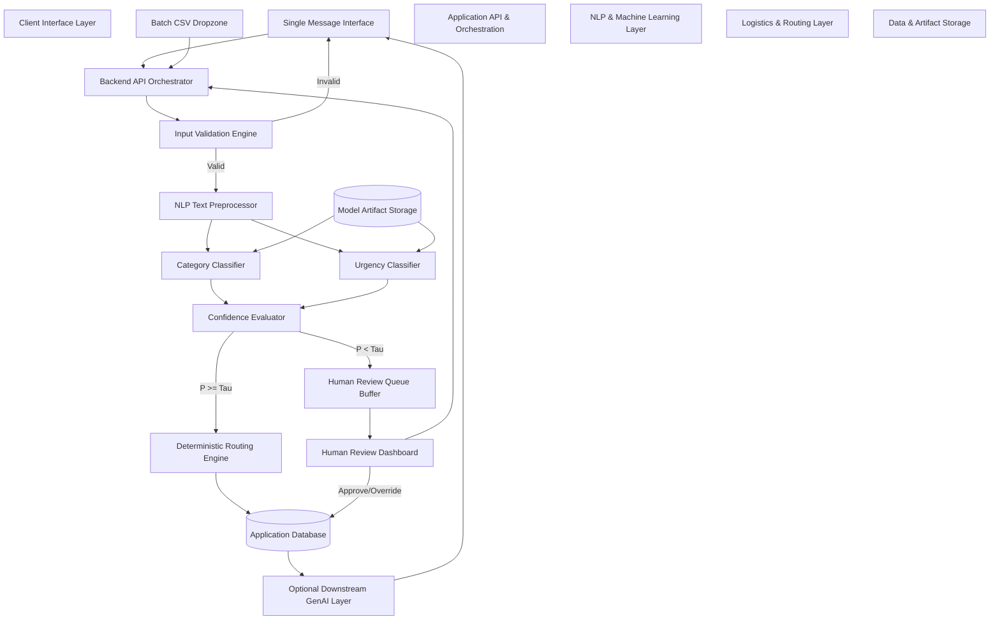
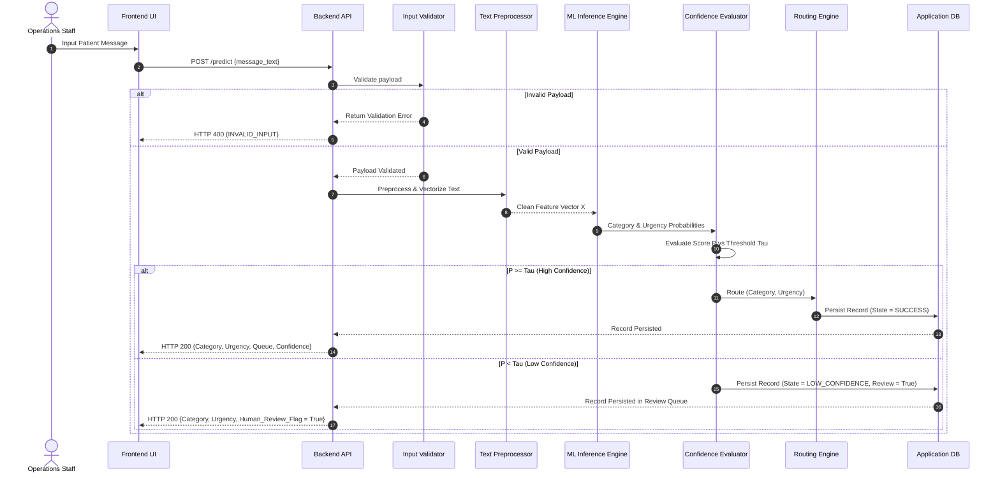

# Section 5 — System Architecture Specification

**Project Title:** Patient Message Triage & Urgency Classifier (PS-1)  
**Track:** Healthcare & HealthTech  
**Author:** Implementation Engineer  
**Supervisor:** Senior Developer / Architect  
**Status:** System Architecture Specification (Approved)  
**Authoritative References:**  
- [SECTION1_PROBLEM_STATEMENT.md](file:///C:/Users/hp/.gemini/antigravity/scratch/patient-message-triage/SECTION1_PROBLEM_STATEMENT.md)  
- [SECTION2_FUNCTIONAL_REQUIREMENTS.md](file:///C:/Users/hp/.gemini/antigravity/scratch/patient-message-triage/SECTION2_FUNCTIONAL_REQUIREMENTS.md)  
- [SECTION3_ACTORS_ROLES_WORKFLOWS.md](file:///C:/Users/hp/.gemini/antigravity/scratch/patient-message-triage/SECTION3_ACTORS_ROLES_WORKFLOWS.md)  
- [SECTION4_DATA_STRATEGY_AND_DATA_CONTRACT.md](file:///C:/Users/hp/.gemini/antigravity/scratch/patient-message-triage/SECTION4_DATA_STRATEGY_AND_DATA_CONTRACT.md)  

---

## 1. Document Overview & Purpose

### 1.1 Purpose
This document defines **Section 5 — System Architecture Specification** for **PS-1 — Patient Message Triage & Urgency Classifier**. It details the structural design, component boundaries, internal communication interfaces, execution flows, security boundaries, and data persistence models governing the system.

### 1.2 Role in System Lifecycle
Section 5 acts as the formal bridge connecting requirements, operational workflows, and data contracts (Sections 1–4) with future technology selection (Section 6), ML pipeline engineering, database modeling, and software implementation.

### 1.3 Implementation-Grade Neutrality
This document specifies **HOW COMPONENTS ARE STRUCTURED AND COMMUNICATE** at a system design level. In accordance with project governance, **NO application code, API endpoints, database schemas, ML models, frontend scripts, Docker files, or infrastructure deployments were executed.**

---

## 2. Architectural Goals & Core Principles

The system architecture is governed by five foundational design principles:

1. **Non-Clinical Operational Scope:** The architecture strictly functions as an administrative message switchboard. It contains zero clinical diagnostic or treatment recommendation logic.
2. **Confidence-Aware Safeguard:** Every classification output is evaluated against a numerical confidence policy. Low-confidence predictions ($P < \tau$) are systematically diverted to a Human Review Queue.
3. **Decoupled Supervised Classifiers:** Category prediction and Urgency assessment operate as distinct functional outputs to prevent semantic entanglement.
4. **Deterministic Auditable Routing:** Operational department queue routing relies on predictable lookup matrices `(Category, Urgency) -> Queue` rather than opaque black-box decisions.
5. **Downstream Generative AI Isolation:** Any optional Generative AI layer is isolated strictly downstream of the supervised ML classifier. GenAI outputs remain non-authoritative administrative assistance and cannot alter category, urgency, confidence, or routing.

---

## 3. Architecture Style Decision & Evaluation

Three structural deployment patterns were evaluated for the PS-1 system:

| Architectural Option | Description | Pros | Cons | Recommendation & Status |
|---|---|---|---|---|
| **Option A: Modular Monolith** | Single deployable application with strict internal module boundaries (Frontend, API, ML, Routing, Storage). | - Low operational overhead<br>- Single process deployment<br>- Ideal for hackathon execution<br>- Easy end-to-end testing | - Monolithic scaling limits at extreme scale | **Proposed MVP Architecture** (`[CONCEPTUAL / PROPOSED]`). |
| **Option B: Microservices Architecture** | Polyglot microservices for API, ML Inference, Routing, and Review Queue via gRPC/HTTP. | - Independent scaling of ML service<br>- Technology isolation | - High DevOps complexity<br>- Network latency overhead<br>- Excessive for MVP scale | Defer for post-MVP enterprise scaling (`[CONCEPTUAL]`). |
| **Option C: Hybrid (App Monolith + ML Service)** | Application backend handles UI/API/DB; ML inference runs in a separate dedicated model service. | - Isolates heavy ML dependencies (PyTorch/Scikit)<br>- Scalable inference worker | - Requires inter-service communication management | Secondary candidate if model dependencies require isolation (`[CONCEPTUAL]`). |

*Decision Summary:* **Option A (Modular Monolith)** is proposed as the baseline architecture for the MVP build. Technology choices remain candidate proposals subject to formal selection in Section 6.

---

## 4. System Context & High-Level Architecture

The conceptual architecture defines data flow from ingestion to structured output:

```
[Message Source / Patient Inquiry]
               |
               v
  [Frontend / User Interface]
               |
               v
     [Backend API Layer]
               |
               v
    [Input Validation Layer]
               |
               v
   [NLP / Preprocessing Layer]
               |
               v
     [ML Inference Layer]
    /                  \
[Category Classifier] [Urgency Classifier]
    \                  /
     +--------+-------+
              |
              v
 [Confidence Evaluation Layer]
              |
      +-------+-------+
      |               |
(P >= Tau)         (P < Tau)
      |               |
      v               v
[Routing Engine] [Human Review Queue]
      |               |
      +-------+-------+
              |
              v
 [Structured Result Payload]
      |               |
      v               v
[Data Storage] [Optional Downstream GenAI Layer]
```

---

## 5. Detailed Component Specifications

---

### 5.1 Message Source Component
- **Role:** Conceptual ingestion point representing incoming patient-support communications.
- **Scope Boundary:** Ingests plain text messages submitted via single-message entry or CSV uploads. Does **NOT** directly implement external EHR webhooks, patient authentication, or patient portals.

---

### 5.2 Frontend / User Interface Component
- **Role:** Web-based operational interface for healthcare administrative personnel.
- **Responsibilities:**
  - **Single Message Interface:** Real-time text entry box, submit button, prediction results panel (Category, Urgency, Confidence %, Assigned Queue, Human Review Flag, Feature Highlights).
  - **Batch CSV Interface:** Drag-and-drop CSV upload dropzone, upload progress indicator, batch execution summary table, row-level results inspection, error report download.
  - **Human Review Queue Interface:** Queue list displaying low-confidence cases, detailed record view (original text, model prediction, confidence score, feature attribution), approve/override routing controls.

---

### 5.3 Backend API / Orchestration Layer
- **Role:** Central application coordinator managing workflow execution, data transformation, and module dispatch.
- **Responsibilities:**
  1. Receive incoming single or batch requests from Frontend.
  2. Invoke Input Validation Layer.
  3. Dispatch valid text to NLP / Preprocessing Layer.
  4. Trigger ML Inference (Category & Urgency Classifiers).
  5. Pass predictions to Confidence Evaluation Layer.
  6. Dispatch outputs to Routing Engine or Human Review Queue based on threshold $\tau$.
  7. Forward structured results to optional GenAI summary layer if enabled.
  8. Persist execution state to Data Storage and emit audit logs.
  9. Format and return JSON payload to UI.

---

### 5.4 Input Validation Layer
- **Role:** Enforces data hygiene and schema boundaries prior to processing.
- **Rules:**
  - Reject empty, null, or whitespace-only messages.
  - Verify message text data type (string).
  - Validate CSV formatting, header names, and non-empty file state.
  - Flag malformed rows in batch mode without halting the entire process.
- **System States Emitted:** `VALID` $\to$ proceed; `INVALID_INPUT` $\to$ return error payload.

---

### 5.5 NLP / Text Preprocessing Layer
- **Role:** Transforms raw text strings into model-compatible numerical representations.
- **Pipeline:**
  $$\text{Raw Text} \xrightarrow{\text{Sanitize}} \text{Cleaned Text} \xrightarrow{\text{Tokenize/Normalize}} \text{Feature Matrix (X)}$$
- **Consistency Guarantee:** Preprocessing executed during inference must match offline model training transformations exactly.
- **Feature Isolation:** Removes metadata (`message_id`, `timestamp`) and excludes target labels (`category`, `urgency`, `department`) to prevent data leakage.

---

### 5.6 ML Inference Layer
- **Role:** Executes supervised natural language processing classification algorithms.
- **Sub-Modules:**
  - **Category Classifier:** Predicts multi-class operational category (`Appointment`, `Billing`, `Medication Refill`, `Report Request`, `Technical Issue`, `Urgent Review`).
  - **Urgency Classifier:** Predicts operational priority (`Routine` vs `Urgent`).

---

### 5.7 Separation of Category & Urgency
- **Architectural Policy:** Category and Urgency represent independent functional dimensions ($\text{Category} \neq \text{Urgency}$).
- **Evaluation of Model Approaches:**
  - *Option A (Two Independent Classifiers):* Separate models for Category and Urgency. *(High modularity, simple tuning; Recommended for MVP)*.
  - *Option B (Single Multi-Output Model):* One joint neural/statistical model emitting dual heads. *(Lower memory footprint; higher training complexity)*.
- *Status:* `[TBD — ML Design]` — Option A is proposed for MVP architecture.

---

### 5.8 Confidence Evaluation Layer
- **Role:** Quantifies prediction reliability and enforces human-in-the-loop safeguards.
- **Logic:**
  - Computes probability score $P(\text{class} \mid \text{text}) \in [0.0, 1.0]$.
  - Compares $P$ against system threshold $\tau$.
  - If $P \ge \tau$: Sets state to `SUCCESS` and forwards to Routing Engine.
  - If $P < \tau$: Sets state to `LOW_CONFIDENCE`, sets `requires_human_review = TRUE`, and routes to Human Review Queue.
- *Threshold Status:* $\tau$ numerical value remains `[TBD — ML/Evaluation Design]`.

---

### 5.9 Routing Engine
- **Role:** Assigns target department queue based on operational rules.
- **Routing Input:** `(Predicted Category, Predicted Urgency)`
- **Routing Output:** `Assigned Operational Queue`
- **Routing Matrix Policy:** Uses a deterministic lookup table `(Category, Urgency) -> Department Queue` to guarantee complete auditability and explainability.

---

### 5.10 Human Review Queue Component
- **Role:** Holding buffer for low-confidence or ambiguous messages ($P < \tau$).
- **Capabilities:**
  - Displays original text, model predictions, confidence scores, and feature highlights.
  - Enables operational reviewers to confirm model predictions or manually override queue assignments.
  - Records reviewer action in audit logs.

---

### 5.11 Structured Result & Output Payload Contract
Per Section 2 specification, every execution emits a standardized structured result payload:
```json
{
  "message_id": "MSG-100402",
  "predicted_category": "Appointment",
  "predicted_urgency": "Routine",
  "confidence_score": 0.92,
  "assigned_queue": "Front Desk / Appointment Queue",
  "requires_human_review": false,
  "status": "SUCCESS"
}
```

---

### 5.12 Data Storage Architecture
Storage is partitioned into two distinct physical/logical layers:

```
+-------------------------------------------------------------------------+
|                       DATA STORAGE ARCHITECTURE                         |
+-------------------------------------------------------------------------+
|                                                                         |
|  +-----------------------------------+   +---------------------------+  |
|  | APPLICATION PERSISTENCE LAYER     |   | MODEL ARTIFACT STORAGE    |  |
|  | - Message Records                 |   | - Vectorizer (.joblib)    |  |
|  | - Prediction Log Records          |   | - Category Model (.pkl)   |  |
|  | - Human Review Audits             |   | - Urgency Model (.pkl)    |  |
|  | - Operational Metrics             |   | - Model Metadata (.json)  |  |
|  +-----------------------------------+   +---------------------------+  |
+-------------------------------------------------------------------------+
```

---

### 5.13 Optional Downstream Generative AI Layer
- **Strict Boundary:** Operates **strictly downstream** of the ML classification and routing engine.
- **Permitted Responsibilities:** Generating concise 1-sentence message summaries or drafting response acknowledgement templates.
- **Strict Prohibition:** **CANNOT** classify categories, determine urgency, evaluate confidence, assign queues, override ML outputs, or generate medical advice.

---

### 5.14 Security & Privacy Architecture
- **Input Sanitization:** Strips executable scripts or malformed HTML from raw text.
- **PII Minimization:** Unnecessary patient identifiers are masked; operational logs avoid long-term PHI storage.
- **Authentication/Authorization:** Role-Based Access Control (RBAC) separates Triage Staff, Reviewers, and Administrators (`[TBD — Security Design]`).

---

### 5.15 Monitoring & Observability Layer
- **Application Metrics:** API response latencies, request throughput, HTTP error rates.
- **ML Operational Metrics:** Distribution of predicted categories/urgencies, low-confidence escalation rate ($P < \tau$), model inference latency.
- **Audit Trail:** Immutable log of all prediction events and reviewer overrides.

---

## 6. End-to-End Execution & Data Flows

---

### 6.1 Single Message Processing Flow

```
[Operations Staff] 
       | (Submits Text)
       v
 [Frontend UI] ----(HTTP POST /predict)----> [Backend API Layer]
                                                   |
                                                   v
                                        [Input Validation Layer]
                                                   |
                                            (Valid Text)
                                                   v
                                      [NLP Preprocessing Layer]
                                                   |
                                          (Feature Vector X)
                                                   v
                                         [ML Inference Layer]
                                         /                  \
                             [Category Model]        [Urgency Model]
                                         \                  /
                                          +--------+-------+
                                                   |
                                            (Probabilities)
                                                   v
                                     [Confidence Evaluation Layer]
                                                   |
                                           < Is P >= Tau? >
                                            /            \
                                         (YES)           (NO)
                                          /                \
                                         v                  v
                                 [Routing Engine]  [Human Review Queue]
                                         |                  |
                                         +--------+---------+
                                                  |
                                                  v
                                     [Format Output Payload]
                                                  |
                                                  v
 [Frontend UI] <----(JSON Response)------- [Backend API Layer]
```

---

### 6.2 Batch CSV Processing Flow

```
[Operations Staff] 
       | (Uploads CSV File)
       v
 [Frontend UI] ----(HTTP POST /batch_predict)----> [Backend API Layer]
                                                         |
                                                         v
                                             [CSV Validation Engine]
                                                         |
                                                  (Valid CSV File)
                                                         |
                                            [Row-by-Row Iteration Loop]
                                                         |
                                          +--------------+--------------+
                                          |                             |
                                    (Valid Row)                  (Malformed Row)
                                          |                             |
                            [Execute Single ML Pipeline]   [Record Row Error State]
                                          |                             |
                            [Assign Queue / Review Flag]                |
                                          \                             /
                                           +--------------+------------+
                                                          |
                                                          v
                                          [Assemble Aggregated Report]
                                                          |
                                                          v
 [Frontend UI] <----(Batch Report JSON)---------- [Backend API Layer]
```

---

### 6.3 Low-Confidence Human Review Flow

```
   [Classifier Output]
            |
            v
 [Confidence P < Threshold Tau]
            |
            v
 [Set State = LOW_CONFIDENCE]
 [Set requires_human_review = TRUE]
            |
            v
 [Persist to Human Review Queue]
            |
            v
 [Human Reviewer Views Record in UI]
  - Original Text
  - Model Category & Urgency
  - Confidence Score P
  - Feature Highlights
            |
            v
 < Reviewer Decision >
  +---------+---------+
  |                   |
[Approve]         [Override]
  |                   |
  +---------+---------+
            |
            v
 [Route to Final Department Queue]
            |
            v
 [Set State = COMPLETED]
```

---

## 7. System State Machine & Error Paths

The life cycle of every ingested message moves through deterministic states:

```
                     +--------------+
                     |   RECEIVED   |
                     +--------------+
                            |
           +----------------+----------------+
           |                                 |
    (Validation Pass)                 (Validation Fail)
           |                                 |
           v                                 v
    +--------------+                 +---------------+
    |  VALIDATED   |                 | INVALID_INPUT |
    +--------------+                 +---------------+
           |
   (Pipeline Error) -------------> [PROCESSING_FAILURE]
           |
   (Pipeline Pass)
           v
    +--------------+
    |  PROCESSING  |
    +--------------+
           |
    (Inference Done)
           v
    +--------------+
    |  PREDICTED   |
    +--------------+
           |
     +-----+-----+
     |           |
 (P >= Tau)   (P < Tau)
     |           |
     v           v
+---------+ +----------------+
| ROUTED  | | LOW_CONFIDENCE |
+---------+ +----------------+
     |           |
     |           v
     |      +--------------+
     |      | HUMAN_REVIEW |
     |      +--------------+
     |           |
     +-----+-----+
           |
           v
    +--------------+
    |  COMPLETED   |
    +--------------+
```

---

## 8. Failure Handling & Resilience Strategy

The system handles operational and technical failures gracefully without data loss or unhandled crashes:

| Failure Mode | Root Cause | System Intercept Action | Output State | User Visibility |
|---|---|---|---|---|
| **Invalid Input** | Empty text, bad CSV, wrong data types | Validation Layer rejects request | `INVALID_INPUT` | Explicit validation error message |
| **Model Unavailable** | Unloaded model artifact, pipeline error | Exception caught; system logs error event | `PROCESSING_FAILURE` | System error alert; no fake predictions |
| **Routing Failure** | Unmapped `(Category, Urgency)` pair | Fallback to Default Administrative Queue | `HUMAN_REVIEW` | Message flagged for manual queue routing |
| **Low Confidence** | Ambiguous message text ($P < \tau$) | Routing engine diverts message to Review Queue | `LOW_CONFIDENCE` | Flagged in UI for Human Reviewer audit |

---

## 9. Comprehensive System Architecture Diagrams (Mermaid)

### 9.1 Diagram 1 — High-Level Component Architecture



---

### 9.2 Diagram 2 — Sequence Diagram (Single Message Processing)



---

## 10. Requirement Traceability Matrix (Section 2 FRs $\to$ Section 5 Components)

| Requirement ID | Section 2 Functional Requirement | Section 5 Architecture Component | Implementation Role |
|---|---|---|---|
| `FR-01` | Message Ingestion Support | Frontend UI + Backend API Layer | Single & Batch ingestion endpoints |
| `FR-02` | Input Data Validation | Input Validation Layer | Schema & data hygiene validation |
| `FR-03` | Text Processing Pipeline | NLP / Text Preprocessing Layer | Normalization & feature vectorization |
| `FR-04` | Category Classification | ML Inference Layer (Category Classifier) | Multi-class operational topic prediction |
| `FR-05` | Urgency Classification | ML Inference Layer (Urgency Classifier) | Operational priority assessment |
| `FR-06` | Confidence Calculation | Confidence Evaluation Layer | Probability calculation & scoring |
| `FR-07` | Human Review Escalation | Confidence Evaluator + Review Queue | Escalation trigger for $P < \tau$ |
| `FR-08` | Department Queue Routing | Routing Engine | Deterministic mapping `(Cat, Urg) -> Queue` |
| `FR-09` | Structured Output Payload | Backend API Layer | Structured JSON result formatting |
| `FR-10` | Prediction Explainability | NLP Layer + Frontend UI | Feature attribution & keyword highlighting |
| `FR-11` | Batch CSV Processing | Backend API + Validation Layer | Row-by-row iteration & batch report |
| `FR-12` | Error Handling & States | System State Machine | `SUCCESS`, `LOW_CONFIDENCE`, `INVALID_INPUT` |
| `FR-13` | Output Schema Validation | Backend API Layer | Output enumeration boundary checks |
| `FR-14` | Logging & Auditability | Monitoring & Audit Layer | Immutable event & review log recording |
| `FR-15` | Optional Downstream GenAI | Optional Downstream GenAI Layer | Non-authoritative summaries/drafts |
| `FR-16` | Healthcare Safety Boundary | Architectural Boundary Guardrails | Strict non-clinical administrative scope |

---

## 11. Open Architectural Decisions Register (`[TBD]`)

The following 16 architectural decisions remain open and are deferred to Section 6, ML Design, or Database Design:

1. **Modular Monolith vs Service Separation:** Selection of Option A (Modular Monolith) vs Option C (App + ML Service) (`[TBD — Technology Selection]`).
2. **Frontend Framework:** Web framework choice (React/Vite vs Vue vs Streamlit) (`[TBD — Technology Selection]`).
3. **Backend API Framework:** API server choice (FastAPI vs Flask vs Django) (`[TBD — Technology Selection]`).
4. **ML Model Architecture:** Algorithm selection (TF-IDF + LogReg vs Naive Bayes vs Linear SVM vs Random Forest) (`[TBD — ML Design]`).
5. **Classifier Coupling:** Independent Category & Urgency models vs Multi-output model (`[TBD — ML Design]`).
6. **Numerical Confidence Threshold ($\tau$):** Quantitative threshold value (e.g., $0.75$) (`[TBD — ML Evaluation]`)..
7. **Confidence Calibration Approach:** Platt scaling vs Isotonic regression vs Raw Max Probability (`[TBD — ML Design]`).
8. **Deterministic Routing Matrix:** Complete mapping table `(Category, Urgency) -> Queue` (`[TBD — System Logic]`).
9. **Human Reviewer Actions:** Reviewer permission scope (Approve/Override vs Edit Text) (`[TBD — UI Design]`).
10. **Application Database Technology:** Relational (SQLite/PostgreSQL) vs Document DB (`[TBD — Technology Selection]`).
11. **Model Artifact Storage Format:** Serialization format (`.joblib` vs `.pkl` vs ONNX) (`[TBD — ML Engineering]`).
12. **Logging Framework:** Logging framework & structured JSON log format (`[TBD — DevOps Design]`).
13. **Monitoring Technology:** Metrics export & dashboard framework (`[TBD — DevOps Design]`).
14. **Authentication & Authorization Protocol:** JWT vs Session-based RBAC (`[TBD — Security Design]`).
15. **Deployment Containerization:** Docker vs Bare-Metal execution (`[TBD — DevOps Design]`).
16. **Downstream GenAI Integration Engine:** Local LLM vs Cloud API for summary generation (`[TBD — GenAI Architecture]`).

---

## 12. Architectural Quality Attributes Evaluation

- **Reliability:** Automated input validation and graceful failure intercepts ensure zero system crashes on bad inputs.
- **Maintainability:** Strict modular separation allows ML models, UI components, and API logic to be modified independently.
- **Scalability:** Stateless API layers allow horizontal expansion if decomposed into microservices post-MVP.
- **Testability:** Decoupled architecture enables independent unit testing of validation, preprocessing, classification, and routing modules.
- **Observability:** Centralized audit logs and metric emission provide end-to-end tracking of triage decisions.
- **Security & Privacy:** Input sanitization, PII masking, and role-based access control minimize privacy exposure.
- **Explainability:** Feature keyword attribution and deterministic routing matrices ensure all decisions are fully auditable by staff.

---

## 13. Scope Boundary & Implementation Safeguard

### 13.1 Section 5 Scope
Section 5 is strictly limited to structural system architecture, component contracts, execution flows, and architectural quality attributes.

### 13.2 Strict Implementation Safeguard
In complete accordance with project governance:
- **NO Python source files were written.**
- **NO JavaScript or frontend frameworks were coded.**
- **NO API endpoints were built.**
- **NO database tables or ORMs were created.**
- **NO machine learning models were trained or saved.**
- **NO Docker containers or CI/CD pipelines were configured.**

---

*Document complete and approved for Section 5 — System Architecture Specification.*
