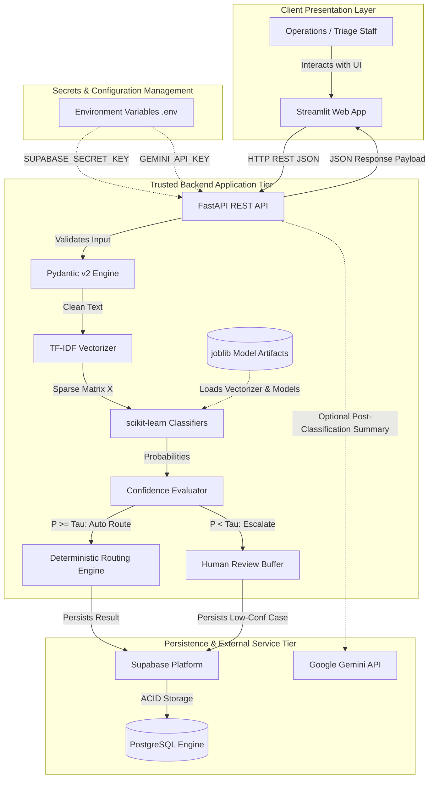

# Section 6 — Technology Stack Selection & Technical Design

**Project Title:** Patient Message Triage & Urgency Classifier (PS-1)  
**Track:** Healthcare & HealthTech  
**Author:** Implementation Engineer  
**Supervisor:** Senior Developer / Architect  
**Status:** Technology Stack Specification (Approved)  
**Authoritative References:**  
- [SECTION1_PROBLEM_STATEMENT.md](file:///C:/Users/hp/.gemini/antigravity/scratch/patient-message-triage/SECTION1_PROBLEM_STATEMENT.md)  
- [SECTION2_FUNCTIONAL_REQUIREMENTS.md](file:///C:/Users/hp/.gemini/antigravity/scratch/patient-message-triage/SECTION2_FUNCTIONAL_REQUIREMENTS.md)  
- [SECTION3_ACTORS_ROLES_WORKFLOWS.md](file:///C:/Users/hp/.gemini/antigravity/scratch/patient-message-triage/SECTION3_ACTORS_ROLES_WORKFLOWS.md)  
- [SECTION4_DATA_STRATEGY_AND_DATA_CONTRACT.md](file:///C:/Users/hp/.gemini/antigravity/scratch/patient-message-triage/SECTION4_DATA_STRATEGY_AND_DATA_CONTRACT.md)  
- [SECTION5_SYSTEM_ARCHITECTURE.md](file:///C:/Users/hp/.gemini/antigravity/scratch/patient-message-triage/SECTION5_SYSTEM_ARCHITECTURE.md)  

---

## 1. Purpose

The purpose of this document is to define the concrete technology stack, technical frameworks, library selections, architectural mappings, and security boundaries required to implement the system architecture specified in Section 5 for **PS-1 — Patient Message Triage & Urgency Classifier**.

This specification formalizes **WHAT TECHNOLOGIES WILL BE USED** to fulfill the functional requirements, operational workflows, and data contracts established in Sections 1 through 5. It serves as an authoritative technical blueprint for subsequent ML engineering, database schema implementation, API engineering, and frontend construction.

> **Implementation Boundary Notice:** This document is strictly an engineering specification. No application code, ML models, synthetic datasets, database tables, API endpoints, frontend components, or deployment containers were created during this step.

---

## 2. Technology Selection Principles

To ensure engineering rigor and maintainability, technology decisions were evaluated against twelve core principles:

1. **Hackathon Development Speed:** High-velocity development cycles, minimal boilerplate, and fast prototyping capability within constrained hackathon timeframes.
2. **ML/NLP Ecosystem Native Compatibility:** Seamless integration between data manipulation libraries, NLP feature extractors, classification algorithms, and web serving layers.
3. **Architectural Maintainability & Modularity:** Clean separation of concerns between presentation, orchestration, validation, inference, and persistence modules.
4. **Implementation Simplicity:** Avoiding speculative infrastructure, premature microservices, or complex distributed orchestration.
5. **Healthcare Security & Privacy Alignment:** Strict credential protection, separation of trust boundaries, and zero exposure of secrets or PHI.
6. **Scalability Potential:** Clean modular architecture that can gracefully evolve into microservices or distributed workers post-MVP.
7. **Testability:** High test ergonomics for automated unit testing, API contract verification, and ML pipeline validation.
8. **Deployment Simplicity:** Predictable containerization and environment management.
9. **Ecosystem & Community Maturity:** Broad documentation, battle-tested production stability, and comprehensive troubleshooting resources.
10. **Integration Compatibility:** REST/JSON standard compliance across frontend, backend, and persistence services.
11. **Cost Efficiency:** Zero or low baseline operating cost utilizing open-source libraries and generous managed service free tiers.
12. **Future Extensibility:** Plug-and-play architectural abstractions for downstream features (e.g., GenAI models, alternate vectorizers, or database scaling).

---

## 3. Project Constraints

The technical design operates under the following inviolable constraints:

- **Strict Non-Clinical Boundary:** The software is an administrative and operational triage router. It must never attempt clinical diagnosis, prescription modifications, or treatment recommendations.
- **Deterministic Supervised Core:** The core categorization, urgency assessment, and routing must be driven by supervised classical ML and deterministic lookup logic—never unconstrained generative models.
- **Isolated Downstream GenAI:** Any generative AI integration must remain strictly downstream, post-classification, non-authoritative, and confined to administrative case summaries or draft acknowledgments.
- **Single-Day Hackathon Delivery:** Technical selections must prioritize quick startup, robust standard libraries, and reliable end-to-end integration over complex multi-tier infrastructures.

---

## 4. Approved Technology Decisions

The senior developer and architect have explicitly established the following foundational decisions:

| Dimension | Approved Decision | Status |
|---|---|---|
| **Primary Programming Language** | **Python (3.11+)** | `[CONFIRMED]` |
| **Backend API Framework** | **FastAPI** | `[CONFIRMED]` |
| **API Schema Validation** | **Pydantic (v2)** | `[CONFIRMED]` |
| **Database Platform** | **Supabase** (Managed Platform) | `[CONFIRMED]` |
| **Database Relational Engine** | **PostgreSQL** | `[CONFIRMED]` |
| **Machine Learning Framework** | **scikit-learn** | `[CONFIRMED]` |
| **NLP Feature Extraction** | **TF-IDF (`TfidfVectorizer`)** | `[CONFIRMED]` |
| **Data Processing Stack** | **Pandas & NumPy** | `[CONFIRMED]` |
| **Model Artifact Storage** | **joblib** | `[CONFIRMED]` |
| **Testing Framework** | **pytest** | `[CONFIRMED]` |
| **Evaluation Visualization** | **Matplotlib** | `[CONFIRMED]` |
| **Optional Downstream GenAI** | **Google Gemini API** | `[CONFIRMED]` |
| **Version Control** | **Git + GitHub** | `[CONFIRMED]` |
| **Containerization Engine** | **Docker** | `[CONFIRMED]` |
| **Credential Management** | **Environment Variables (`.env`)** | `[CONFIRMED]` |

---

## 5. Programming Language: Python

### 5.1 Selection
**Python (Version 3.11+)** is selected as the unified implementation language for the backend API, machine learning pipeline, data processing scripts, validation layer, and auxiliary tooling.

### 5.2 Technical Rationale
- **Ecosystem Dominance:** Python is the de facto standard for NLP, statistical classification, and data engineering (`scikit-learn`, `pandas`, `numpy`).
- **High-Performance Asynchronous Web Serving:** Modern Python runtime (3.11+) with ASGI servers (`uvicorn`) delivers high throughput with low latency for REST APIs.
- **Unified Language Stack:** Eliminates cross-language context switching, serialization overhead, and separate build tooling across data science and web backend domains.
- **Model Serialization & Portability:** Native integration with `joblib` for zero-friction export and loading of trained vectorizers and classifier artifacts.

---

## 6. Backend Technology: FastAPI

### 6.1 Selection
**FastAPI** is selected as the primary backend orchestration framework, executed via ASGI server **Uvicorn**.

### 6.2 Technical Rationale
- **Asynchronous Execution & High Throughput:** Native `asyncio` architecture enables efficient concurrent handling of batch requests and external I/O (Supabase, Gemini API).
- **Native Pydantic Integration:** Automatic request validation, data sanitization, and response serialization matching the canonical contracts from Section 4.
- **Automated OpenAPI / Swagger Documentation:** Automatically generates interactive API documentation (`/docs` and `/redoc`), significantly accelerating frontend-backend integration and API testing.
- **Clean Dependency Injection:** Allows database sessions, model artifact caches, and configuration settings to be injected cleanly across route handlers.

---

## 7. API Validation: Pydantic

### 7.1 Selection
**Pydantic (v2)** is selected as the schema validation and data parsing engine across the backend API layer.

### 7.2 Technical Rationale
- **Contract Enforcement:** Strictly enforces the canonical data schemas defined in Section 4 (`message_id`, `message_text`, `category`, `urgency`, `department`, `confidence_score`).
- **Input Sanitization:** Intercepts null inputs, empty strings, and malformed types before they reach the NLP preprocessing pipeline, emitting standard `INVALID_INPUT` responses.
- **JSON Serialization Performance:** Pydantic v2 core is compiled in Rust, delivering ultra-fast serialization of tabular batch predictions and model inference outputs.

---

## 8. Frontend Technology: Streamlit

### 8.1 Evaluated Alternatives

| Frontend Alternative | Hackathon Velocity | UI Flexibility | Batch CSV Support | Review Queue Ergonomics | Maintenance Overhead | Evaluation Outcome |
|---|---|---|---|---|---|---|
| **Option A: Streamlit** | **Extremely High** | Moderate (Widget-based) | Native (`st.file_uploader`, dataframes) | Excellent (Interactive data tables, selectboxes) | Very Low (Pure Python, unified stack) | **SELECTED FOR MVP** |
| **Option B: HTML + CSS + JS** | Moderate | High (Custom DOM) | Requires custom JS FileReader/DOM code | Requires manual table rendering and state management | Moderate | Non-optimal for 1-day hackathon |
| **Option C: React + Vite** | Moderate / Low | Very High (Full component ecosystem) | Requires multi-file frontend state management | Complex state synchronization with backend API | High (Separate Node toolchain, build pipelines) | Deferred for post-MVP enterprise UI |

### 8.2 Technical Selection & Rationale
**Streamlit** is selected as the MVP frontend framework.
- **Rapid Prototyping in Hackathon Context:** Streamlit enables the creation of a fully functional, professional dashboard in pure Python within hours, eliminating JavaScript build toolchain friction.
- **Native Tabular & Visual Ergonomics:** Built-in components (`st.dataframe`, `st.metric`, `st.bar_chart`, `st.file_uploader`) natively render batch CSV results, confusion matrices, and confidence distributions.
- **Clean Decoupled Architecture:** The Streamlit application interacts with the backend via standard HTTP REST calls (`requests` / `httpx`), preserving the strict client-server decoupling established in Section 5.

---

## 9. Machine Learning Framework: scikit-learn

### 9.1 Selection
**scikit-learn** is selected as the core machine learning library for model development, pipeline execution, and performance evaluation.

### 9.2 Technical Rationale
- **Comprehensive Classical ML Suite:** Provides robust implementations of candidate classifiers (Logistic Regression, Multinomial Naive Bayes, Linear SVM, Random Forest).
- **Evaluation Tooling:** Built-in metrics calculation (`precision_recall_fscore_support`, `confusion_matrix`, `classification_report`) matching Section 2 evaluation mandates.
- **Pipeline Architecture:** Scikit-learn's `Pipeline` API guarantees identical feature transformations between training time and runtime inference, preventing distribution skew.
- **Lightweight Deployment Footprint:** Eliminates the heavy GPU dependencies and massive binary sizes of deep learning frameworks (PyTorch/TensorFlow), enabling fast container builds and instant inference.

---

## 10. NLP & Feature Extraction: TF-IDF

### 10.1 Selection
**TF-IDF (`TfidfVectorizer` from `scikit-learn`)** is selected as the baseline feature extraction engine for text vectorization.

### 10.2 Technical Rationale
- **Sample Efficiency on 300–1,000 Messages:** TF-IDF excels on small-to-medium specialized healthcare administrative corpora where complex transformer embeddings are prone to overfitting without massive fine-tuning.
- **Feature Attribution & Explainability:** Term frequency and inverse document frequency weights map directly to vocabulary tokens, enabling straightforward keyword attribution for prediction explanations.
- **Sub-Millisecond Inference Latency:** Vectorization is performed via sparse matrix multiplication, executing in single-digit milliseconds per message.
- **Strict Anti-Leakage Hygiene:** The vectorizer is fitted strictly on the training partition and serialized to `joblib` for identical inference reuse.

---

## 11. Data Processing Stack: Pandas & NumPy

### 11.1 Selection
**Pandas** and **NumPy** are selected for data manipulation, synthetic data generation parsing, batch CSV execution, and matrix operations.

### 11.2 Division of Responsibilities
- **Pandas:**
  - Ingestion and schema parsing of raw synthetic datasets and user-uploaded batch CSV files.
  - Tabular aggregation, missing-value filtering, and deduplication verification.
  - Row-by-row iteration and aggregated batch prediction structuring.
- **NumPy:**
  - Low-level array operations, probability vector manipulation, and confidence score threshold evaluations.

---

## 12. Database Technology: Supabase + PostgreSQL

### 12.1 Explicit Approved Architecture
The project architecture strictly utilizes:
- **Database Engine:** **PostgreSQL** (Enterprise relational SQL engine).
- **Database Platform:** **Supabase** (Managed cloud PostgreSQL backend platform).

```
+-------------------------------------------------------------------------+
|                        APPLICATION PERSISTENCE                          |
+-------------------------------------------------------------------------+
|                                                                         |
|  +--------------------+        REST / SQL        +-------------------+  |
|  | FastAPI Backend    | -----------------------> | Supabase Platform |  |
|  +--------------------+                          +-------------------+  |
|                                                            |            |
|                                                            v            |
|                                                  +-------------------+  |
|                                                  | PostgreSQL Engine |  |
|                                                  +-------------------+  |
+-------------------------------------------------------------------------+
```

### 12.2 Technical Rationale
- **True Relational Integrity:** PostgreSQL guarantees ACID compliance, foreign key constraints, and structured schema typing across messages, predictions, routing results, and human review records.
- **Managed Operational Simplicity:** Supabase provides instant hosted PostgreSQL, automated backups, web management dashboards, and high-availability database infrastructure without manual server administration.
- **Audit & Analytics Readiness:** PostgreSQL handles indexing, full-text queries, and JSONB payloads for storing model feature highlights and audit metadata.

---

## 13. Database Security Boundary & Credential Separation

Credential access to Supabase must adhere to strict zero-trust boundary segregation:

```
[ Untrusted Client (Browser / Streamlit UI) ]
                     |
                     | (Uses Client-Safe Anonymous Key ONLY, if direct read required)
                     v
             +-----------------------+
             |   Supabase Gateway    |
             +-----------------------+
                     ^
                     | (Uses Privileged Service Role Key - SERVER SIDE ONLY)
                     |
[ Trusted Backend API (FastAPI Server) ]
```

### 13.1 Segregation Rules
- **Server-Only Service Secret:** The privileged Supabase Service Role Key (`SUPABASE_SECRET_KEY`) has administrative database privileges and must **NEVER** be exposed to frontend code, browser DOM, JavaScript, or public repositories.
- **Public Client Key:** If direct client-side read queries are utilized, they must use the restricted public publishable key (`SUPABASE_PUBLISHABLE_KEY`) bound by PostgreSQL Row Level Security (RLS) policies.
- **All Production Mutations via Backend:** In the proposed MVP architecture, all database mutations (inserting predictions, logging review overrides) originate exclusively from the trusted FastAPI backend.

---

## 14. Model Artifact Storage: joblib

### 14.1 Evaluated Serialization Formats

| Format | Compatibility | Serialization Speed | Disk Footprint | Security / Simplicity | Evaluation Outcome |
|---|---|---|---|---|---|
| **joblib** | scikit-learn native | **Fastest for NumPy arrays** | Compact compressed binary | Standard scikit-learn convention | **SELECTED FOR MVP** |
| **pickle** | Built-in Python | Slower on large sparse matrices | Standard | Python standard, less optimized for arrays | Fallback |
| **ONNX** | Cross-platform | High conversion complexity | Optimized | Excessive complexity for hackathon MVP | Deferred for future production |

### 14.2 Conceptual Artifact Structure
Model artifacts are versioned and stored in a structured filesystem directory:
```text
models/
├── v1.0.0/
│   ├── tfidf_vectorizer.joblib
│   ├── category_classifier.joblib
│   ├── urgency_classifier.joblib
│   └── model_metadata.json
└── active_model_manifest.json
```

---

## 15. Testing Technology: pytest

### 15.1 Selection
**pytest** is selected as the automated testing suite for backend validation, ML pipeline verification, and integration tests.

### 15.2 Test Coverage Scope
- **Input Validation Tests:** Empty text rejection, whitespace filtering, malformed CSV structure detection (`INVALID_INPUT`).
- **Preprocessing Tests:** Normalization consistency, special character handling, zero training leakage.
- **Routing Engine Tests:** Deterministic verification of `(Category, Urgency) -> Queue` lookup matrices.
- **Confidence Policy Tests:** Threshold boundary evaluation ($P \ge \tau \to \text{Route}$, $P < \tau \to \text{Human Review}$).
- **API Contract Tests:** Validation of JSON response structures against Pydantic schemas.

---

## 16. Visualization: Matplotlib

### 16.1 Selection
**Matplotlib** (with optional **Seaborn** integration for aesthetic rendering) is selected as the baseline evaluation charting engine.

### 16.2 Intended Visualizations
- Multi-class Confusion Matrix heatmaps across the 6 operational categories.
- Precision-Recall curves and F1 score distribution charts.
- Urgency class distribution and low-confidence escalation rate plots for the operational dashboard.

---

## 17. Optional Downstream GenAI: Google Gemini API

### 17.1 Selection & Role Definition
**Google Gemini API (via official `google-genai` Python SDK)** is selected as the optional downstream generative AI provider.

### 17.2 Strict Boundary Architecture
The Generative AI layer operates strictly downstream of the supervised classification system:

```
[Patient Support Message]
           |
           v
[Supervised ML Classifier (scikit-learn)]
           |
  (Predicts Category, Urgency, Confidence, Queue)
           |
           v
[Structured Prediction Result Payload]
           |
           +---------------------------------------+
           |                                       |
           v                                       v
[Core Triage & Routing Engine]          [Optional Downstream Gemini]
  - Assigns Department Queue              - Generates 1-Sentence Summary
  - Evaluates Confidence vs Tau           - Drafts Staff Acknowledgment Template
  - Emits Mandatory Payload               - Appends Non-Authoritative Metadata
           |                                       |
           +-------------------+-------------------+
                               |
                               v
                     [Final Staff Viewport]
```

### 17.3 Prohibited & Permitted Actions
- **STRICTLY PROHIBITED:**
  - Diagnosing medical conditions or evaluating symptom severity.
  - Recommending medications, dosages, or clinical treatments.
  - Overriding category, urgency, confidence, or queue routing.
  - Acting as the primary classification engine.
- **PERMITTED:**
  - Generating a concise 1-sentence administrative synopsis of long patient inquiries.
  - Drafting a polite operational acknowledgement message for staff review and manual dispatch.

---

## 18. GenAI Abstraction Layer

To prevent tight vendor lock-in to a single generative AI API, the backend architecture defines a generic LLM service interface:

```
+-------------------------------------------------------------+
|                  ILlmService (Interface)                    |
|  - generate_summary(message_text: str) -> str               |
|  - draft_acknowledgment(category: str, text: str) -> str    |
+-------------------------------------------------------------+
                              |
              +---------------+---------------+
              |                               |
              v                               v
+---------------------------+   +---------------------------+
| GeminiLlmProvider         |   | MockLlmProvider           |
| (Uses google-genai SDK)   |   | (Fallback for Offline)    |
+---------------------------+   +---------------------------+
```
This abstraction allows switching providers or disabling generative calls entirely without affecting core triage functionality.

---

## 19. Secret Management & Environment Configuration

### 19.1 Zero-Secrets In Repository Mandate
All credentials, API keys, and connection strings must be injected via environment variables at runtime:
- **NEVER** hard-code secrets in source code, markdown documentation, or client-side assets.
- **NEVER** commit `.env` files containing actual values to version control.
- Ensure `.gitignore` explicitly excludes `.env`, `.env.local`, and sensitive credential files.

### 19.2 Conceptual Environment Manifest (`.env.example`)
```bash
# Application Environment
ENVIRONMENT=development
APP_PORT=8000
DEBUG=True

# Supabase Managed Database Configuration
SUPABASE_URL=https://your-project-id.supabase.co
SUPABASE_PUBLISHABLE_KEY=your-anon-publishable-key
SUPABASE_SECRET_KEY=your-service-role-secret-key

# Optional Generative AI Provider
GEMINI_API_KEY=your-gemini-api-key-here
ENABLE_GENAI_SUMMARY=False

# Model Configuration
MODEL_VERSION=v1.0.0
CONFIDENCE_THRESHOLD=0.75
```

---

## 20. Version Control: Git + GitHub

- **Source Management:** Git for local revision control; GitHub for remote repository hosting, code review, and project documentation tracking.
- **Branch Strategy:** Feature-branch isolation (`feature/data-contract`, `feature/ml-pipeline`, `feature/api-endpoints`) merging into `main` via pull requests.

---

## 21. Containerization: Docker

- **Engine:** Docker (utilizing multi-stage builds on `python:3.11-slim`).
- **Role:** Guarantees deterministic runtime execution across developer workstations and cloud hosts.
- **Status:** Container architecture is specified; creation of executable `Dockerfile` and `docker-compose.yml` is deferred to the DevOps phase.

---

## 22. Deployment Strategy & Hosting Candidates

### 22.1 MVP Hosting Requirements
- Linux runtime environment supporting Python 3.11+.
- Secure runtime injection of environment variables.
- HTTPS termination for public web access.
- Outbound connectivity to Supabase HTTPS endpoints and Google Gemini API.

### 22.2 Candidate Hosting Environments
- **Option 1: Streamlit Community Cloud (Frontend) + Managed Container Platform (Backend):** Extremely rapid deployment for hackathon presentation.
- **Option 2: Unified Container Hosting (Render / Railway / Fly.io):** Single container or dual-service setup hosting FastAPI and Streamlit concurrently.
- **Option 3: Local Containerized Demo (Docker Compose):** High-reliability offline/local presentation fallback.
- *Status:* `[TBD — Deployment/DevOps Phase]` — Hosting target to be finalized during the DevOps task.

---

## 23. Technology Comparison Tables

### 23.1 Backend Framework Evaluation

| Criteria | FastAPI | Flask | Django |
|---|---|---|---|
| **Async Support** | Native (ASGI / Asyncio) | Extension-based | Native (ASGI support) |
| **Data Validation** | Built-in (Pydantic v2) | Manual (Marshmallow/custom) | Django Forms / DRF |
| **API Docs** | Automated Swagger/OpenAPI | Manual (Flasgger) | Manual (drf-yasg) |
| **Execution Latency** | Ultra Low | Low | Moderate (Heavy ORM) |
| **Hackathon Speed** | **High** | Moderate | Low (Heavy boilerplate) |
| **Decision** | **SELECTED** | Rejected | Rejected |

### 23.2 Frontend Framework Evaluation

| Criteria | Streamlit | HTML5 / CSS / Vanilla JS | React + Vite |
|---|---|---|---|
| **Language** | Pure Python | HTML / JS / CSS | TypeScript / JSX |
| **Build Tooling** | None (Runs directly) | None | Node.js, npm, Vite |
| **CSV & Data Tables** | Built-in (`st.dataframe`) | Manual DOM construction | TanStack Table / Ag-Grid |
| **Time to Interactive MVP**| **< 4 Hours** | ~ 8 Hours | ~ 12 Hours |
| **Decision** | **SELECTED FOR MVP** | Rejected | Deferred for Enterprise UI |

### 23.3 Database Platform Evaluation

| Criteria | Supabase + PostgreSQL | Local SQLite | Raw Self-Hosted Postgres |
|---|---|---|---|
| **Architecture** | Managed Cloud DB + Dashboard | Serverless Local File | Self-managed container |
| **Relational Integrity** | Full ACID / PostgreSQL | Full ACID (File lock limits) | Full ACID |
| **Operational Overhead** | Zero Server Maintenance | Zero Maintenance | High (Setup, tuning, backups)|
| **Web Admin UI** | Built-in Visual Dashboard | Requires DB Browser tool | Requires pgAdmin setup |
| **Decision** | **APPROVED DECISION** | Rejected | Rejected |

### 23.4 Model Artifact Serialization Evaluation

| Criteria | joblib | pickle | ONNX |
|---|---|---|---|
| **NumPy Optimization** | Optimized binary dump | Generic Python serializer | Cross-language graph format |
| **Load Speed** | **Fastest for scikit-learn** | Moderate | Fast inference |
| **Pipeline Simplicity** | 1-line dump/load | 1-line dump/load | Complex graph export |
| **Decision** | **SELECTED** | Fallback | Deferred |

---

## 24. Final Proposed MVP Technology Stack

| Layer / Domain | Final Technology Selection | Version Target | Selection Role |
|---|---|---|---|
| **Programming Language** | **Python** | `3.11+` | Core development language |
| **Backend API Server** | **FastAPI** + **Uvicorn** | `0.110+` | API routing and orchestration |
| **Schema Validation** | **Pydantic** | `v2.6+` | Input sanitization & contract typing |
| **Frontend Presentation** | **Streamlit** | `1.32+` | Operations dashboard & triage UI |
| **Machine Learning** | **scikit-learn** | `1.4+` | Classifier training & evaluation |
| **NLP Feature Extraction** | **TF-IDF (`TfidfVectorizer`)** | scikit-learn | Term frequency feature vectorizer |
| **Data Processing** | **Pandas** & **NumPy** | `2.2+` / `1.26+` | Tabular data manipulation & arrays |
| **Database Platform** | **Supabase** | Cloud API | Managed PostgreSQL hosting |
| **Database Engine** | **PostgreSQL** | `15+` | Relational SQL persistence engine |
| **Model Storage** | **joblib** | `1.3+` | Artifact serialization (`.joblib`) |
| **Testing Suite** | **pytest** + **httpx** | `8.0+` | Unit & API integration tests |
| **Data Visualization** | **Matplotlib** | `3.8+` | Confusion matrix & metric plots |
| **Optional GenAI** | **Google Gemini API** | `google-genai` | Downstream summary & draft generation |
| **Version Control** | **Git + GitHub** | Git `2.40+` | Source management & team workflow |
| **Containerization** | **Docker** | `25.0+` | Deterministic deployment packaging |
| **Secret Management** | **Environment Variables** | `.env` / os.environ | Zero-secrets credential management |
| **Cloud Hosting** | **Candidate: Render / Streamlit Cloud** | `[TBD]` | Deployment host (`[TBD]`) |

---

## 25. Architecture-to-Technology Mapping

```
Section 5 Conceptual Component               Section 6 Implementation Technology
---------------------------------------------------------------------------------
Message Source Ingestion        ===========>  Streamlit UI & FastAPI REST Routes
Input Validation Layer          ===========>  Pydantic v2 Models & Validators
NLP Preprocessing Layer         ===========>  scikit-learn TfidfVectorizer
Category Classifier             ===========>  scikit-learn Classifier (.joblib)
Urgency Classifier              ===========>  scikit-learn Classifier (.joblib)
Confidence Evaluation Layer     ===========>  NumPy Probability Threshold Logic
Routing Engine                  ===========>  Python Deterministic Matrix Lookup Table
Human Review Queue              ===========>  Supabase DB Table + Streamlit Review View
Application Database            ===========>  Supabase + PostgreSQL
Model Artifact Storage          ===========>  Filesystem / Volume (.joblib binaries)
Optional GenAI Component        ===========>  Google Gemini API (google-genai SDK)
Testing & Quality Suite         ===========>  pytest Test Runner
Monitoring & Audit Logs         ===========>  Python Logging Framework + Supabase Logs
```

---

## 26. Technology-Level Security Considerations

1. **Server-Side API Key Confinement:** The `GEMINI_API_KEY` and `SUPABASE_SECRET_KEY` exist solely in backend runtime memory and are never transmitted across network hops to the client.
2. **Strict Client/Server Trust Boundary:** The Streamlit UI communicates with the FastAPI backend over authenticated HTTPS endpoints; no direct database administrator credentials reside on the client.
3. **Malicious CSV Upload Sanitization:** File ingestors enforce maximum payload size caps, MIME-type verification (`text/csv`), header structure checks, and escape sequence sanitization to prevent CSV injection vulnerabilities.
4. **Input Length Throttling:** Pydantic validators constrain input text lengths (e.g., maximum 5,000 characters) to prevent memory exhaustion or regular expression denial of service (ReDoS).
5. **Secret Scanning Safeguards:** Local `.gitignore` configurations exclude credential files, virtual environment directories, and cache folders.

---

## 27. Healthcare Safety Boundary Enforcement

- **Strict Non-Diagnostic Scope:** The software architecture contains no medical ontology engines, symptom checkers, or diagnostic inference models.
- **Operational Routing Only:** The ML models predict administrative and logistical queues (`Billing`, `Front Desk`, `Medical Records`, `Tech Support`, `Medication Refill`, `Urgent Review`).
- **Downstream LLM Isolation:** The Gemini API receives only post-classification structured payloads; it has zero architectural authority to alter predicted classes, override urgency, or redirect queues.
- **Human Safeguard Guarantee:** Predictions with confidence below threshold $\tau$ are systematically halted from automated routing and diverted to human operator review.

---

## 28. Cost Considerations for Hackathon MVP

- **Python, FastAPI, Streamlit, scikit-learn, Pandas, pytest:** 100% Free, Open Source (MIT / BSD / Apache-2.0 licenses).
- **Supabase:** Free Tier includes 500MB database storage, unlimited API requests, and up to 50,000 monthly active users—more than sufficient for hackathon demonstration.
- **Google Gemini API:** Free Tier / promotional credits allow up to 15 Requests Per Minute (RPM) for Gemini 1.5/2.0 models on synthetic data, incurring \$0.00 infrastructure cost for hackathon testing.
- **Hosting:** Free or low-cost hosting tiers (Streamlit Community Cloud, Render Free Tier) support public demo accessibility without cloud spend.

---

## 29. Future Production Evolution

Following the hackathon MVP, the architecture can evolve into an enterprise healthcare solution:

```
[MVP Hackathon Stack]                             [Future Enterprise Production]
FastAPI Monolith              ----------------->  Kubernetes Microservices Architecture
Streamlit UI                  ----------------->  React / TypeScript Portal (EHR Embedded)
Local .joblib Models          ----------------->  MLflow / S3 Versioned Model Registry
Synchronous Inference         ----------------->  Celery / Redis Asynchronous Task Queues
Supabase Free Tier            ----------------->  HIPAA-Compliant Dedicated PostgreSQL RDS
Gemini Public API             ----------------->  Self-Hosted Llama-3 / Private HIPAA Vertex AI
```

---

## 30. Dependencies on Future Sections

Section 6 establishes technical selections but intentionally defers detailed algorithmic, schema, and interface implementations to subsequent phases:

- **Section 7 — Machine Learning & NLP Design:**
  - Selection of specific classifier algorithms (Logistic Regression vs Linear SVM vs Naive Bayes).
  - Hyperparameter tuning grids, n-gram ranges, and stop-word filtering rules.
  - Confidence calculation formulas, calibration methods (Platt scaling), and numerical threshold $\tau$.
- **Database Design Phase:**
  - Exact SQL table definitions (`CREATE TABLE`), column constraints, foreign keys, and indexes in Supabase PostgreSQL.
- **API Design Phase:**
  - Concrete REST path definitions (`POST /api/v1/triage`, `POST /api/v1/batch-triage`), error response schemas, and status codes.
- **DevOps Phase:**
  - Production `Dockerfile`, `docker-compose.yml`, and hosting deployment configuration.

---

## 31. Open Decision Register (`[TBD]`)

The following technical decisions remain open and will be resolved in later dedicated phases:

1. **Exact Supervised ML Algorithm:** Final winner among Logistic Regression, Linear SVM, and Naive Bayes (`[TBD — Section 7]`)..
2. **Classifier Topology:** Two independent binary/multiclass models vs single multi-output estimator (`[TBD — Section 7]`)..
3. **Confidence Calibration Method:** Platt scaling vs raw probability score ($P$) (`[TBD — Section 7]`)..
4. **Numerical Confidence Threshold ($\tau$):** Exact cutoff value (e.g., $0.75$ or $0.80$) (`[TBD — Section 7]`)..
5. **Exact SQL Schema Definition:** Table creation scripts and relational constraints (`[TBD — Database Design]`)..
6. **Production Deployment Host:** Selection between Render, Streamlit Cloud, and Railway (`[TBD — DevOps Phase]`)..
7. **CI/CD Automation Pipeline:** GitHub Actions workflow scripts (`[TBD — DevOps Phase]`)..
8. **GenAI Exact Prompt Template:** Specific system prompt for administrative summary generation (`[TBD — GenAI Design]`)..

---

## 32. Section 5 Traceability Matrix

| Section 5 Architectural Component | Section 6 Selected Technology | Traceability & Alignment |
|---|---|---|
| **Message Ingestion & Frontend** | Streamlit | Direct UI for single text entry and CSV upload |
| **Backend API Orchestrator** | FastAPI + Uvicorn | High-performance asynchronous REST API |
| **Input Validation Layer** | Pydantic (v2) | Strict schema parsing and error handling |
| **NLP Preprocessing Engine** | scikit-learn `TfidfVectorizer` | Deterministic text vectorization |
| **ML Inference Classifiers** | scikit-learn Classifiers | Multi-class category and urgency inference |
| **Confidence Evaluation** | NumPy Probability Logic | Compares model probability against threshold $\tau$ |
| **Deterministic Routing Engine** | Python Lookup Dictionary | Maps `(Category, Urgency) -> Queue` |
| **Data Storage Layer** | Supabase + PostgreSQL | Structured relational persistence for messages/reviews |
| **Model Artifact Storage** | joblib (`.joblib` files) | Compact binary serialization of trained models |
| **Downstream GenAI Layer** | Google Gemini API (`google-genai` SDK)| Non-authoritative administrative summary/draft |
| **Quality & Test Automation** | pytest + httpx | Automated unit, regression, and API contract tests |
| **Secret & Credential Boundary**| Python `os.environ` / `.env` | Complete isolation of server-side secrets |

---

## 33. Technology Architecture Diagram (Mermaid)



---

## 34. Implementation Boundary Safeguard

### 34.1 Section 6 Scope
Section 6 is strictly limited to technology evaluation, stack finalization, technical architecture mapping, and security boundary documentation.

### 34.2 Explicit No-Implementation Confirmation
In strict compliance with architectural directives:
- **NO Python source files were written.**
- **NO FastAPI routes or endpoints were coded.**
- **NO Streamlit scripts or frontend components were built.**
- **NO machine learning models were trained or serialized.**
- **NO synthetic datasets were generated.**
- **NO database tables or SQL migrations were executed.**
- **NO connection to Supabase was initiated.**
- **NO calls to the Google Gemini API were executed.**
- **NO API keys or secrets were embedded in the repository.**
- **NO Dockerfiles or deployment configurations were created.**

---

*Document complete and approved for Section 6 — Technology Stack Selection & Technical Design.*
