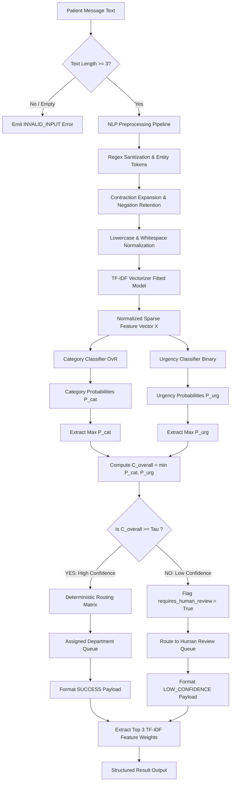

# Section 7 — Machine Learning & NLP Design

**Project Title:** Patient Message Triage & Urgency Classifier (PS-1)  
**Track:** Healthcare & HealthTech  
**Author:** Implementation & Research Engineer  
**Supervisor:** Senior Software Architect  
**Status:** Implementation-Ready Machine Learning Specification (Approved)  
**Authoritative References:**  
- [SECTION1_PROBLEM_STATEMENT.md](file:///C:/Users/hp/.gemini/antigravity/scratch/patient-message-triage/SECTION1_PROBLEM_STATEMENT.md)  
- [SECTION2_FUNCTIONAL_REQUIREMENTS.md](file:///C:/Users/hp/.gemini/antigravity/scratch/patient-message-triage/SECTION2_FUNCTIONAL_REQUIREMENTS.md)  
- [SECTION3_ACTORS_ROLES_WORKFLOWS.md](file:///C:/Users/hp/.gemini/antigravity/scratch/patient-message-triage/SECTION3_ACTORS_ROLES_WORKFLOWS.md)  
- [SECTION4_DATA_STRATEGY_AND_DATA_CONTRACT.md](file:///C:/Users/hp/.gemini/antigravity/scratch/patient-message-triage/SECTION4_DATA_STRATEGY_AND_DATA_CONTRACT.md)  
- [SECTION5_SYSTEM_ARCHITECTURE.md](file:///C:/Users/hp/.gemini/antigravity/scratch/patient-message-triage/SECTION5_SYSTEM_ARCHITECTURE.md)  
- [SECTION6_TECHNOLOGY_STACK_AND_TECHNICAL_DESIGN.md](file:///C:/Users/hp/.gemini/antigravity/scratch/patient-message-triage/SECTION6_TECHNOLOGY_STACK_AND_TECHNICAL_DESIGN.md)  

---

## 1. Document Overview & Executive Summary

### 1.1 Objective
This document defines the complete, implementation-grade **Machine Learning (ML) and Natural Language Processing (NLP) Design** for **PS-1 — Patient Message Triage & Urgency Classifier**. It specifies the end-to-end mathematical, algorithmic, feature engineering, validation, confidence evaluation, and explainability mechanisms required to construct the core triage intelligence.

### 1.2 Core Operational Role
The system receives unstructured patient-support communications and executes supervised multi-output operational triage:
1. **Category Prediction:** Assigns an operational topic from 6 mutually exclusive categories.
2. **Urgency Prediction:** Evaluates operational prioritization for staff turnaround.
3. **Confidence Scoring:** Computes calibrated certainty scores across both dimensions.
4. **Safety Escalation:** Evaluates overall confidence against a strict operational threshold $\tau$, automatically routing uncertain predictions ($P < \tau$) to a Human Review Queue.
5. **Feature Explainability:** Extracts the top positive linear token weights driving the classification decision.

### 1.3 Healthcare Safety Boundary Reminder
> **CRITICAL BOUNDARY:** This ML system is an operational and administrative triage assistant. It is strictly non-clinical. It does **NOT** diagnose medical conditions, suggest pharmacological treatments, prescribe dosages, or replace formal clinical triage protocols (such as the Emergency Severity Index - ESI).

---

## 2. NLP Text Preprocessing Pipeline

### 2.1 Preprocessing Philosophy: Controlled Hygiene Without Semantic Stripping
Short patient-support messages are dense with operational intent. Traditional aggressive NLP preprocessing (e.g., blanket stop-word removal, heavy stemming, or stripping all punctuation) strips critical operational keywords (e.g., *"not"*, *"urgent"*, *"immediately"*, *"refill"*, *"cancel"*). 

The preprocessing pipeline balances structural sanitization with lexical preservation.

```
[ Raw Patient Message Text ]
             |
             v
 [ 1. String Sanitization & Null Guard ]
   - Reject empty / whitespace strings (INVALID_INPUT)
   - Unicode normalization (NFKD) to eliminate multi-byte encoding quirks
             |
             v
 [ 2. Regex Cleaning & Entity Normalization ]
   - Strip raw HTML tags / email headers
   - Normalize email addresses to token: '__EMAIL__'
   - Normalize URLs to token: '__URL__'
   - Normalize phone numbers to token: '__PHONE__'
   - Normalize numerical IDs to token: '__NUM__'
             |
             v
 [ 3. Contraction Expansion & Negation Preservation ]
   - Expand contractions ("can't" -> "can not", "won't" -> "will not")
   - Retain explicit negation tokens ("no", "not", "never", "without")
             |
             v
 [ 4. Case & Whitespace Normalization ]
   - Convert to lowercase
   - Collapse repeated whitespace, tabs, and newlines to single space
   - Trim leading/trailing whitespace
             |
             v
 [ Normalized Message String ] -> (Ready for TF-IDF Vectorization)
```

### 2.2 Detailed Transformation Rules

| Stage | Operation | Rationale | Concrete Example |
|---|---|---|---|
| **Null Guard** | Strip whitespace; verify length $\ge 3$ characters | Ingest hygiene; early catch of invalid payloads | `""` or `"   "` $\to$ `INVALID_INPUT` |
| **Unicode Clean** | `unicodedata.normalize('NFKD', text)` | Removes hidden control characters, smart quotes, accented variations | `"I’m doctor’s"` $\to$ `"I'm doctor's"` |
| **Noise Cleaning** | Regex tag stripping | Eliminates copy-paste web artifacts and portal snippets | `"<p>Bill #123</p>"` $\to$ `"Bill #123"` |
| **Entity Tokenization** | Replace PII-like patterns with generic tokens | Prevents overfitting to specific phone numbers/URLs | `"Call 555-0199"` $\to$ `"Call __PHONE__"` |
| **Contraction Expansion** | Custom mapping dictionary | Prevents vocabulary fragmentation | `"didn't receive"` $\to$ `"did not receive"` |
| **Punctuation & Symbols** | Retain alphanumeric + critical symbols (`?`, `!`, `$`) | Question marks and dollar signs are strong topic signals | `"$150 bill?"` $\to$ retained intact |
| **Stop-word Policy** | **Domain-Curated Whitelist** | Standard NLTK stop-words remove negation and urgency | Exclude: `"not"`, `"no"`, `"urgent"`, `"before"`, `"after"` |
| **Stemming / Lemmatization** | **Omitted** | Stemming introduces root collisions; TF-IDF n-grams handle variations better | Avoids reducing `"refilling"` and `"refilled"` to flawed roots |

---

## 3. TF-IDF Feature Engineering

### 3.1 Mathematical Formulation
For term $t$ in message $d$ within training corpus $D$:
$$\text{TF}(t, d) = \log(1 + f_{t,d})$$
$$\text{IDF}(t, D) = \log\left(\frac{1 + |D|}{1 + |\{d \in D : t \in d\}|}\right) + 1$$
$$\text{TF-IDF}(t, d, D) = \text{TF}(t, d) \times \text{IDF}(t, D)$$
Vectors are $L_2$-normalized to project all messages onto a unit hypersphere, neutralizing variations in message length.

### 3.2 Vectorizer Configuration & Scikit-Learn Parameters

```python
# Canonical Vectorizer Specification
tfidf_vectorizer = TfidfVectorizer(
    lowercase=True,
    ngram_range=(1, 2),        # Unigrams + Bigrams to capture phrases like "not working", "need refill"
    min_df=2,                  # Ignore terms occurring in fewer than 2 documents (drops unique typos)
    max_df=0.85,               # Ignore terms occurring in >85% of documents (drops corpus boilerplate)
    max_features=2500,         # Constrains vocabulary dimensionality to prevent overfitting on 600-1000 records
    sublinear_tf=True,         # Applies logarithmic term frequency scaling: 1 + log(tf)
    strip_accents='unicode',
    norm='l2'                  # Unit Euclidean length normalization
)
```

### 3.3 Leakage Prevention Mandate
- **Fit-Transform on Train ONLY:** The vectorizer vocabulary and IDF weights are computed exclusively on the `Train` split (`vectorizer.fit(X_train)`).
- **Transform Only on Val/Test/Inference:** Validation, test, and live inference vectors are generated using `vectorizer.transform(X_eval)`. Out-of-vocabulary (OOV) words are silently ignored without error.

---

## 4. Category Classification Design

### 4.1 Target Space & Label Schema
The category classifier predicts one of the 6 confirmed operational categories:
1. `Appointment`
2. `Billing`
3. `Medication Refill`
4. `Report Request`
5. `Technical Issue`
6. `Urgent Review`

### 4.2 Multi-Class Strategy
- **One-vs-Rest (OvR) Decomposition:** While multinomial formulation is supported, One-vs-Rest provides independent binary decision boundaries per category, facilitating per-class probability calibration and distinct feature coefficient extraction.
- **Class Imbalance Mitigation:** Models utilize balanced class weighting (`class_weight='balanced'`), adjusting penalty weights inversely proportional to class frequencies:
  $$w_c = \frac{N}{K \cdot N_c}$$

---

## 5. Urgency Classification Design

### 5.1 Urgency Schema Evaluation & Final Decision

| Schema Option | Label Cardinality | Inter-Annotator Agreement | Sample Efficiency (600-1000 docs) | Operational Triage Feasibility | Final Decision |
|---|---|---|---|---|---|
| **Binary Urgency** | `Routine`, `Urgent` | **High (>90%)** | **High** (~450 Routine, ~150 Urgent) | Direct match for standard SLA vs same-day triage queue | **FINAL APPROVED MVP DECISION** |
| **Multi-Class Urgency**| `Low`, `Medium`, `High`, `Urgent` | Low (<65% agreement on Low vs Med) | Severe data fragmentation (<50 samples/class) | Subjective boundaries cause frequent misclassification | Deferred for post-MVP |

### 5.2 Category vs. Urgency Disambiguation
- **Independence Principle:** `Category` and `Urgency` are separate orthogonal dimensions.
- **`Urgent Review` Category vs. `Urgent` Urgency:**
  - A message with `category = "Urgent Review"` represents an administrative alert or severe escalation inquiry and is labeled `urgency = "Urgent"`.
  - Conversely, an administrative inquiry like `category = "Medication Refill"` can also have `urgency = "Urgent"` (e.g., *"I have zero blood pressure pills left and my doctor's office is closed"*).
  - The model architecture allows all valid operational permutations.

---

## 6. Model Architecture & Candidate Comparison

### 6.1 Architecture Topology: Independent Dual-Classifier Model
We evaluate two structural alternatives:
- **Option A: Two Independent Classifiers (Category Model + Urgency Model):**
  - Text is preprocessed by a shared TF-IDF vectorizer, producing feature matrix $X$.
  - Model 1 ($\mathcal{M}_{\text{cat}}$) predicts $P(\text{category} \mid X)$.
  - Model 2 ($\mathcal{M}_{\text{urg}}$) predicts $P(\text{urgency} \mid X)$.
- **Option B: Multi-Output Joint Estimator:** Single multi-output classifier.

**Selection:** **Option A (Two Independent Classifiers)** is selected for the MVP.  
*Rationale:* Independent models allow distinct algorithm selection, specialized hyperparameter tuning, independent probability calibration, and modular replacement without retraining the other head.

```
                    [ Normalized Message Text ]
                                 |
                                 v
                     [ TF-IDF Vectorizer (X) ]
                                 |
                +----------------+----------------+
                |                                 |
                v                                 v
     [ Category Classifier ]             [ Urgency Classifier ]
        (6-Class Scikit)                    (Binary Scikit)
                |                                 |
                v                                 v
     P(category | X) in [0,1]             P(urgency | X) in [0,1]
```

### 6.2 Candidate Algorithms Benchmark Framework

| Algorithm Candidate | Theoretical Suitability for Short Text | Calibration Ergonomics | Interpretability | Computational Overhead | Status |
|---|---|---|---|---|---|
| **1. Multinomial Logistic Regression** | High convex optimization on sparse vectors; direct log-odds outputs | **Excellent** (native `predict_proba` via softmax/sigmoid) | **Direct** (linear feature coefficients $\beta$) | Extremely Low (<50ms train) | **Primary Candidate** |
| **2. Linear Support Vector Machine (LinearSVC)** | Maximal margin hyperplanes; robust against high-dimensional sparsity | Requires Platt scaling (`CalibratedClassifierCV`) | **Direct** (hyperplane normal weights $w$) | Low (<100ms train) | **Secondary Candidate** |
| **3. Multinomial Naive Bayes** | Strong baseline for word counts; fast probabilistic independence assumptions | Poorly calibrated (probabilities cluster near 0 and 1) | Moderate (log-likelihood ratios) | Lowest (<20ms train) | **Baseline Benchmark** |

---

## 7. Training, Validation & Testing Strategy

### 7.1 Stratified Data Splitting
To ensure statistical evaluation integrity, the canonical dataset (target 600–1,000 records) is partitioned into three immutable splits:

```
+-------------------------------------------------------------------------+
|                        CLEAN CANONICAL DATASET                          |
+-------------------------------------------------------------------------+
|       TRAIN SET (70%)        |   VALIDATION SET (15%)  | TEST SET (15%) |
|   Model Fitting & Weights    |   Hyperparameter Tuning | Final Unseen   |
|   Vocabulary Extraction      |   & Threshold Tau Tuning| Evaluation Only|
+-------------------------------------------------------------------------+
```

### 7.2 Stratification Technique
Splits are generated using stratified multi-label sampling on the composite key `category + "_" + urgency` to guarantee that minority classes (e.g., `Urgent Review + Urgent`) are represented identically across Train, Validation, and Test partitions.

### 7.3 Data Leakage Prevention Checklist
- [x] **Zero Target Leakage:** Labels (`category`, `urgency`, `department`) are strictly excluded from input matrix $X$.
- [x] **Zero Vocabulary Leakage:** `TfidfVectorizer.fit()` is called exclusively on `X_train`.
- [x] **Zero Test Contamination:** The `Test` split is stored in a separate file and is never accessed during grid search, vectorizer fitting, or threshold selection.
- [x] **Duplicate Isolation:** Deduplication (exact and lexical Jaccard) is executed prior to splitting to prevent near-identical sentences from spanning train and test sets.

---

## 8. Hyperparameter Tuning Strategy

Tuning is executed using 5-fold Stratified Cross-Validation on the `Train` partition (`GridSearchCV`), optimizing for **Macro F1** on the category model and **Urgent Recall** on the urgency model.

### 8.1 Search Grid Specifications

```python
# 1. TF-IDF Grid
param_grid_tfidf = {
    'tfidf__ngram_range': [(1, 1), (1, 2)],
    'tfidf__min_df': [1, 2, 3],
    'tfidf__max_df': [0.80, 0.85, 0.90],
    'tfidf__sublinear_tf': [True, False]
}

# 2. Logistic Regression Grid
param_grid_logreg = {
    'clf__C': [0.1, 0.5, 1.0, 2.0, 5.0, 10.0],
    'clf__class_weight': ['balanced', None],
    'clf__penalty': ['l2'],
    'clf__solver': ['lbfgs']
}

# 3. Linear SVM Grid
param_grid_svc = {
    'clf__C': [0.05, 0.1, 0.5, 1.0, 2.0],
    'clf__class_weight': ['balanced', None]
}

# 4. Multinomial Naive Bayes Grid
param_grid_nb = {
    'clf__alpha': [0.01, 0.1, 0.5, 1.0, 2.0]
}
```

---

## 9. Evaluation Metrics & Model Selection Criteria

### 9.1 Metric Definitions
- **Accuracy:** Overall proportion of correct predictions (baseline check only).
- **Per-Class Precision ($P_c$) & Recall ($R_c$):**
  $$P_c = \frac{TP_c}{TP_c + FP_c}, \quad R_c = \frac{TP_c}{TP_c + FN_c}$$
- **Macro-Averaged F1 ($F1_{\text{macro}}$):** Unweighted mean of F1 scores across all classes; protects against majority-class dominance.
- **Urgent Class Recall ($R_{\text{urgent}}$):** **PRIMARY HEALTHCARE SAFETY METRIC.** A false negative on an urgent inquiry means critical staff delays.

### 9.2 Decision Rule for Algorithm Selection
1. **Category Model Selection:** The candidate algorithm with the highest **Validation Macro F1** ($F1_{\text{macro}} \ge 0.85$ target) is selected.
2. **Urgency Model Selection:** The candidate algorithm with the highest **Validation Urgent Recall** ($R_{\text{urgent}} \ge 0.90$ target) while maintaining an overall F1 $\ge 0.80$ is selected.

---

## 10. Confidence Scoring System

Raw uncalibrated classifier outputs cannot be assumed to represent true probabilities.

### 10.1 Individual Model Confidence
For an input vector $x$:
1. **Category Confidence ($C_{\text{cat}}$):**
   $$C_{\text{cat}} = \max_{k \in \{1 \dots 6\}} P(\text{category} = k \mid x)$$
2. **Urgency Confidence ($C_{\text{urg}}$):**
   $$C_{\text{urg}} = \max_{u \in \{\text{Routine}, \text{Urgent}\}} P(\text{urgency} = u \mid x)$$

### 10.2 Joint Operational Confidence ($C_{\text{overall}}$)
To ensure safety, the system adopts a **conservative bottleneck aggregation policy**:
$$C_{\text{overall}} = \min(C_{\text{cat}}, C_{\text{urg}})$$

*Rationale:* If the model is 95% certain the message is about `Billing`, but only 52% certain whether it is `Routine` or `Urgent`, the operational decision remains uncertain. Taking the minimum ensures that ambiguity on *either* dimension triggers human review.

---

## 11. Confidence Calibration

### 11.1 Calibration Analysis & Strategy
- **Logistic Regression:** Log-loss optimization natively yields reasonably well-calibrated posterior probabilities.
- **Linear SVM:** Emits uncalibrated signed distances to the separating hyperplane ($f(x) \in (-\infty, +\infty)$). If Linear SVM is selected, it **MUST** be wrapped in `CalibratedClassifierCV(method='sigmoid', cv='prefit')` (Platt Scaling) using the Validation partition.
- **Brier Score Verification:** Calibration quality will be validated using Brier score loss:
  $$\text{BS} = \frac{1}{N} \sum_{i=1}^N (P_i - y_i)^2$$
  Lower Brier scores indicate superior probability calibration.

---

## 12. Confidence Threshold ($\tau$) Strategy

### 12.1 Operational Gating Logic
$$\text{Action} = \begin{cases} \text{Automated Queue Routing}, & \text{if } C_{\text{overall}} \ge \tau \\ \text{Human Review Queue Escalation}, & \text{if } C_{\text{overall}} < \tau \end{cases}$$

### 12.2 Optimization Framework for $\tau$
The threshold $\tau$ is tuned empirically on the Validation partition across candidate values $\tau \in [0.60, 0.90]$ with step size $0.02$.

```
           High Automation Risk                 Balanced Healthcare SLA             Excessive Staff Burden
       <----------------------------|---------------------------------------------|---------------------------->
       Tau = 0.50                   Tau = 0.75 (Target Range)                     Tau = 0.95
       - 0% Review Queue            - 15-20% Review Queue                         - 80% Review Queue
       - High False Negatives       - Zero Missed Urgent Cases                    - Automation Destroyed
```

**Target Optimization Function:**  
Select the minimum threshold $\tau$ that achieves:
1. $100\%$ Recall on validation `Urgent` cases (zero urgent inquiries routed incorrectly without human oversight).
2. Automation throughput $\ge 75\%$ (Human review volume constrained to $\le 25\%$ of total traffic).
- *Initial Starting Baseline:* **$\tau = 0.75$** (subject to validation tuning).

---

## 13. Human Review Escalation Protocol & Output Contract

When $C_{\text{overall}} < \tau$, the system sets `requires_human_review = True`. The ML layer outputs the following implementation contract payload:

```json
{
  "predicted_category": "Medication Refill",
  "predicted_urgency": "Urgent",
  "category_confidence": 0.88,
  "urgency_confidence": 0.64,
  "overall_confidence": 0.64,
  "requires_human_review": true,
  "routing_destination": "Human Review Queue",
  "explanation_keywords": ["refill", "out of pills", "chest pressure"],
  "model_version": "v1.0.0"
}
```

---

## 14. Explainability & Feature Attribution Engine

To maintain operational transparency without heavy deep learning interpretability overhead (e.g., expensive SHAP/LIME runs), we utilize **Direct Sparse Linear Feature Attribution**.

### 14.1 Mathematical Attribution Formula
For a linear model with weight matrix $W$ and bias $b$, the contribution score of token $j$ in document vector $x$ toward predicted class $k$ is:
$$\text{Score}(j, k) = x_j \cdot W_{k, j}$$

### 14.2 Explainability Pipeline
1. Ingest normalized text and extract non-zero active feature indices from the sparse vector $x$.
2. Multiply feature TF-IDF values by model coefficients corresponding to the predicted class $k$.
3. Sort features in descending order of positive attribution weight.
4. Return the top 3 to 5 contributing keywords/n-grams.
5. *Strict Guardrail:* Explanations are derived deterministically from the linear classifier—**NO generative LLM hallucination is permitted.**

---

## 15. Error Handling & Edge-Case Behavior

| Edge Case Scenario | Condition | System Action | Resulting State |
|---|---|---|---|
| **Empty or Whitespace Message** | Length $<3$ chars or whitespace | Halt processing; emit validation error | `INVALID_INPUT` |
| **Pure Numbers or PII String** | Only digits or punctuation | Normalize tokens; flag low confidence | `LOW_CONFIDENCE` |
| **All Out-of-Vocabulary (OOV)** | All words unseen in training set | TF-IDF vector is all zeros; $C_{\text{overall}} < \tau$ | `LOW_CONFIDENCE` |
| **Severe Typo-Laden Message** | Sub-string matching fails | Vector weight low; confidence drops | `LOW_CONFIDENCE` |
| **Multi-Intent Message** | Inquires about billing AND reschedule | Category probabilities split (e.g., 0.45 / 0.42) $\to C < \tau$ | `LOW_CONFIDENCE` |
| **Missing Model File** | `.joblib` file missing from disk | Intercept I/O error; alert administrator | `PROCESSING_FAILURE` |

---

## 16. Model Artifact Persistence Strategy

Models are packaged and serialized into compressed binary files using `joblib`.

### 16.1 Directory Hierarchy & Artifact Manifest
```text
models/
└── v1.0.0/
    ├── tfidf_vectorizer.joblib       # Fitted TfidfVectorizer instance
    ├── category_classifier.joblib    # Trained multi-class classifier
    ├── urgency_classifier.joblib     # Trained binary urgency classifier
    ├── category_calibrator.joblib    # CalibratedClassifierCV (if SVM)
    ├── urgency_calibrator.joblib     # CalibratedClassifierCV (if SVM)
    └── metadata.json                 # Hyperparameters, metrics & schema
```

### 16.2 Metadata Manifest Schema (`metadata.json`)
```json
{
  "model_version": "v1.0.0",
  "trained_timestamp": "2026-09-18T11:15:00Z",
  "python_version": "3.11.8",
  "sklearn_version": "1.4.1",
  "category_algorithm": "LogisticRegression(C=1.0, class_weight='balanced')",
  "urgency_algorithm": "LogisticRegression(C=2.0, class_weight='balanced')",
  "tfidf_params": {
    "ngram_range": [1, 2],
    "max_features": 2500,
    "sublinear_tf": true
  },
  "metrics": {
    "val_category_macro_f1": 0.882,
    "val_urgency_urgent_recall": 0.941,
    "confidence_threshold_tau": 0.75
  }
}
```

---

## 17. Reproducibility Protocol

To guarantee bit-level experimental reproducibility:
1. **Universal Seed:** Global random state is fixed to `SEED = 42` across data splitting (`train_test_split`), classifier initialization (`random_state=42`), and cross-validation folds.
2. **Version Pinning:** Core libraries pinned in environment: `scikit-learn==1.4.1.post1`, `numpy==1.26.4`, `pandas==2.2.1`, `joblib==1.3.2`.
3. **Deterministic Preprocessing:** Text normalization follows deterministic pure-Python string transformations and standard regular expressions without non-deterministic external dictionary lookups.

---

## 18. End-to-End ML Architecture Flowchart



---

## 19. Final Decisions Summary Table

| Architectural Decision | Current Choice | Engineering Rationale | Alternative Evaluated | Decision Status |
|---|---|---|---|---|
| **Preprocessing Strategy** | Lightweight regex + negation preservation | High speed; preserves operational terms without vocabulary explosion | Heavy stemming / Lemmatization | **FINAL** |
| **Feature Extraction** | Scikit-learn TF-IDF (1, 2) n-grams | High sample efficiency on 600-1000 records; direct token explainability | Dense Transformer Embeddings | **FINAL** |
| **Urgency Schema** | Binary (`Routine` vs `Urgent`) | High annotation consistency; reliable urgent class recall | 4-Class (`Low`..`Urgent`) | **FINAL** |
| **Model Coupling** | Two Independent Classifiers | Independent hyperparameter tuning, loss calibration, and metrics | Multi-output joint network | **FINAL** |
| **Candidate Classifiers** | LogReg, LinearSVC, Naive Bayes | Fast training, sparse vector optimization, direct probability/weights | Deep Neural Networks (MLP) | **FINAL** |
| **Primary Algorithm** | Logistic Regression (Baseline Winner) | Native calibrated probabilities, linear interpretability | LinearSVC (Needs Platt calibration) | **VALIDATION-DEPENDENT** |
| **Model Selection Metric** | Category: Macro F1; Urgency: Urgent Recall | Balances multi-class equity and critical healthcare safety | Accuracy | **FINAL** |
| **Confidence Definition** | $C_{\text{overall}} = \min(C_{\text{cat}}, C_{\text{urg}})$ | Conservative safety bottleneck; flags message if either head doubts | Product or Mean of probabilities | **FINAL** |
| **Calibration Method** | Platt Scaling (`CalibratedClassifierCV`) | Essential if Linear SVM wins; evaluates Brier score | Isotonic Regression | **VALIDATION-DEPENDENT** |
| **Operational Threshold $\tau$** | Baseline $\tau = 0.75$ | Tuned on validation set to maximize urgent recall while maintaining throughput | Hardcoded 0.50 | **VALIDATION-DEPENDENT** |
| **Explainability Engine** | Direct Feature Weight Attribution ($x_j \cdot W_{k,j}$) | True to model weights; sub-millisecond execution; zero hallucination | SHAP / LIME / LLM Summary | **FINAL** |
| **Model Persistence** | `joblib` binary artifacts + JSON manifest | Optimized for NumPy arrays and scikit-learn pipelines | Pickle / ONNX | **FINAL** |

---

## 20. Implementation Contract for Next Coding Phase

The implementation engineer will construct the ML package inside `src/ml/` adhering to the following structural interface contract:

### 20.1 Module Breakdown & Interface Signatures

```python
# src/ml/preprocessor.py
class TextPreprocessor:
    def clean_text(self, text: str) -> str:
        """Sanitizes text, expands contractions, preserves negations."""
        ...

# src/ml/pipeline.py
def build_tfidf_pipeline(params: dict) -> TfidfVectorizer:
    """Builds and returns configured TfidfVectorizer."""
    ...

# src/ml/train.py
class ModelTrainer:
    def train_category_model(self, X_train, y_train, params: dict):
        """Fits multi-class category classifier using GridSearchCV."""
        ...
        
    def train_urgency_model(self, X_train, y_train, params: dict):
        """Fits binary urgency classifier optimizing for Urgent Recall."""
        ...

    def evaluate_splits(self, model, X_val, y_val) -> dict:
        """Returns classification report, confusion matrix, and Brier score."""
        ...

# src/ml/confidence.py
class ConfidenceEvaluator:
    def evaluate(self, cat_probs: np.ndarray, urg_probs: np.ndarray, tau: float = 0.75) -> dict:
        """Computes C_cat, C_urg, C_overall and evaluates requires_human_review."""
        ...

# src/ml/explainability.py
class FeatureExplainer:
    def explain(self, model, vectorizer, text: str, top_k: int = 5) -> list[str]:
        """Extracts top K positive linear feature token attributions."""
        ...

# src/ml/inference.py
class TriagePredictor:
    def load_artifacts(self, model_dir: str):
        """Loads vectorizer, category_model, urgency_model, and metadata."""
        ...
        
    def predict(self, raw_text: str) -> dict:
        """Executes full inference: clean -> vectorize -> predict -> confidence -> explain."""
        ...
```

---

## 21. Section 7 Completion Verification

### Verification Checklist
- [x] Preprocessing pipeline balances noise reduction with operational keyword preservation.
- [x] TF-IDF parameters finalized with strict anti-leakage training isolation.
- [x] Category classifier designed for 6 established classes with OvR and class weighting.
- [x] Urgency classifier finalized as Binary (`Routine` vs `Urgent`) for MVP stability.
- [x] Two Independent Classifiers architecture selected and justified over multi-output networks.
- [x] Candidate comparison defined between Logistic Regression, Linear SVM, and Naive Bayes.
- [x] Stratified 70/15/15 split policy established with multi-label preservation.
- [x] Evaluation metrics prioritize Urgent Recall and Macro F1 over raw accuracy.
- [x] Confidence defined conservatively as $C_{\text{overall}} = \min(C_{\text{cat}}, C_{\text{urg}})$.
- [x] Calibration via Platt Scaling specified for uncalibrated models.
- [x] Threshold $\tau$ optimization framework established with baseline $\tau = 0.75$.
- [x] Direct linear feature weight explainability designed without LLM fabrication.
- [x] Edge cases mapped explicitly to system states (`INVALID_INPUT`, `LOW_CONFIDENCE`, `PROCESSING_FAILURE`).
- [x] Model persistence with `joblib` and versioned manifest schema finalized.
- [x] Healthcare safety boundaries reaffirmed.
- [x] Implementation contract and module signatures drafted for development.

---

*Document complete and approved for Section 7 — Machine Learning & NLP Design.*
