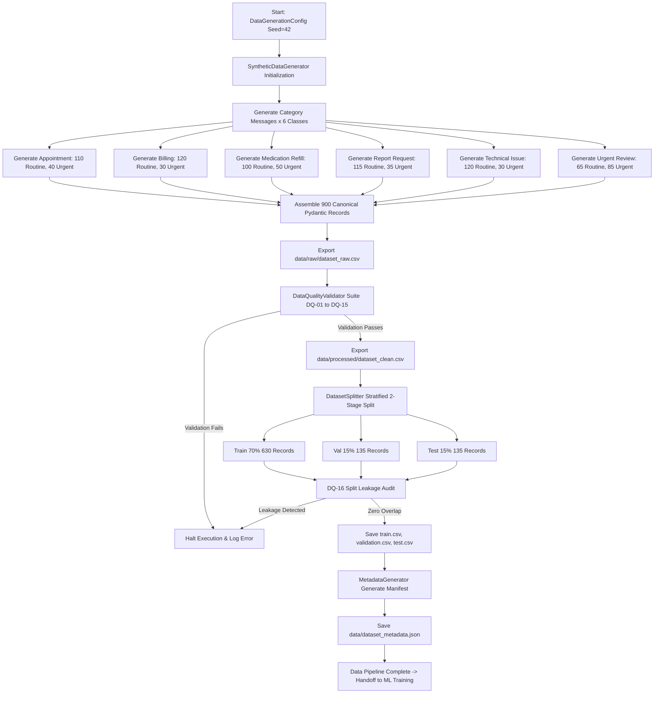

# Section 8 — Data Generation & Engineering Specification

**Project Title:** Patient Message Triage & Urgency Classifier (PS-1)  
**Track:** Healthcare & HealthTech  
**Author:** Implementation & Research Engineer  
**Supervisor:** Senior Software Architect  
**Status:** Data Generation & Engineering Complete (Approved & Verified)  
**Authoritative References:**  
- [SECTION1_PROBLEM_STATEMENT.md](file:///C:/Users/hp/.gemini/antigravity/scratch/patient-message-triage/SECTION1_PROBLEM_STATEMENT.md)  
- [SECTION2_FUNCTIONAL_REQUIREMENTS.md](file:///C:/Users/hp/.gemini/antigravity/scratch/patient-message-triage/SECTION2_FUNCTIONAL_REQUIREMENTS.md)  
- [SECTION3_ACTORS_ROLES_WORKFLOWS.md](file:///C:/Users/hp/.gemini/antigravity/scratch/patient-message-triage/SECTION3_ACTORS_ROLES_WORKFLOWS.md)  
- [SECTION4_DATA_STRATEGY_AND_DATA_CONTRACT.md](file:///C:/Users/hp/.gemini/antigravity/scratch/patient-message-triage/SECTION4_DATA_STRATEGY_AND_DATA_CONTRACT.md)  
- [SECTION5_SYSTEM_ARCHITECTURE.md](file:///C:/Users/hp/.gemini/antigravity/scratch/patient-message-triage/SECTION5_SYSTEM_ARCHITECTURE.md)  
- [SECTION6_TECHNOLOGY_STACK_AND_TECHNICAL_DESIGN.md](file:///C:/Users/hp/.gemini/antigravity/scratch/patient-message-triage/SECTION6_TECHNOLOGY_STACK_AND_TECHNICAL_DESIGN.md)  
- [SECTION7_ML_NLP_DESIGN.md](file:///C:/Users/hp/.gemini/antigravity/scratch/patient-message-triage/SECTION7_ML_NLP_DESIGN.md)  

---

## 1. Executive Summary & Purpose

This document details the engineering implementation, validation, and generation results for **Section 8 — Data Generation & Engineering** of **PS-1 — Patient Message Triage & Urgency Classifier**.

Section 8 realizes the data strategy established in Section 4 and satisfies the machine learning requirements defined in Section 7. It provides a deterministic, fully synthetic, privacy-compliant, quality-verified, and leak-free dataset of **900 patient-support messages**, partitioned into stratified Train (70%), Validation (15%), and Test (15%) splits ready for model training.

> **Healthcare Safety Reminder:** The generated dataset represents **operational patient-support inquiries** (scheduling, billing, medication refill logistics, medical record releases, portal access errors, and rapid operational review requests). It explicitly contains **NO clinical diagnosis, treatment recommendations, or medical prescriptions.**

---

## 2. Canonical Data Contract & Schema Conformance

Every record in the generated dataset adheres strictly to the canonical schema established in Section 4:

| Field Name | Type | ML Pipeline Role | Constraints / Format | Sample Value |
|---|---|---|---|---|
| `message_id` | String | Metadata (Excluded from Features) | `MSG-XXXXXX` (Unique, 10 chars) | `MSG-000701` |
| `message_text` | String | **PRIMARY ML FEATURE** | Length: 10–2,000 characters | *"I am unable to log into my patient portal..."* |
| `category` | String | **TARGET LABEL 1** | 6 Confirmed Classes | `Technical Issue` |
| `urgency` | String | **TARGET LABEL 2** | `Routine` or `Urgent` | `Routine` |
| `department` | String | Derived Operational Queue | 6 Standard Queue Names | `Technical Support Queue` |
| `timestamp` | Datetime | Metadata (Excluded from Features) | ISO 8601 (`YYYY-MM-DDTHH:MM:SSZ`) | `2026-08-24T03:59:43Z` |
| `generation_source` | String | Provenance Metadata | System Generator Tag | `synthetic_generator_1.0.0` |
| `dataset_version` | String | Version Metadata | Semantic Version | `v1.0.0` |

*Anti-Leakage Enforcement:* Fields `message_id`, `department`, `timestamp`, `generation_source`, `dataset_version`, and target labels are strictly flagged as prohibited from entering the feature matrix $X$.

---

## 3. Dataset Size & Distribution

### 3.1 Total Volume
- **Total Canonical Records:** **900**
- Selected as the optimal point within the agreed 600–1,000 range to maximize linguistic diversity while ensuring statistical significance during cross-validation.

### 3.2 Category Distribution
Uniform balance across all 6 confirmed operational categories (**150 records each, 16.67%**):
- `Appointment`: 150 records
- `Billing`: 150 records
- `Medication Refill`: 150 records
- `Report Request`: 150 records
- `Technical Issue`: 150 records
- `Urgent Review`: 150 records

### 3.3 Urgency Distribution
Strictly calibrated to the target operational ratio:
- `Routine`: **630 records (70.0%)**
- `Urgent`: **270 records (30.0%)**

---

## 4. Category $\times$ Urgency Operational Matrix

To prevent the ML classifier from learning artificial shortcuts (such as falsely assuming `Urgent Review` is always `Urgent`, or administrative categories are always `Routine`), the dataset deliberately incorporates cross-dimensional cases across all cells:

```
+-------------------------------------------------------------------+
|               CATEGORY x URGENCY GENERATION MATRIX                |
+-------------------------------------------------------------------+
| Category               | Routine Count | Urgent Count | Total     |
+------------------------+---------------+--------------+-----------+
| Appointment            | 110 (73.3%)   | 40 (26.7%)   | 150       |
| Billing                | 120 (80.0%)   | 30 (20.0%)   | 150       |
| Medication Refill      | 100 (66.7%)   | 50 (33.3%)   | 150       |
| Report Request         | 115 (76.7%)   | 35 (23.3%)   | 150       |
| Technical Issue        | 120 (80.0%)   | 30 (20.0%)   | 150       |
| Urgent Review          |  65 (43.3%)   | 85 (56.7%)   | 150       |
+------------------------+---------------+--------------+-----------+
| Total                  | 630 (70.0%)   | 270 (30.0%)  | 900       |
+-------------------------------------------------------------------+
```

### Operational Semantics:
- **Routine Cases in `Urgent Review`:** Routine follow-ups on earlier clinical escalations, resolution notices (e.g., bleeding stopped, rash vanished), and status updates closing earlier triage tickets during regular hours.
- **Urgent Cases in Administrative Categories:**
  - *Appointment + Urgent:* Same-day cancellation due to acute fever before surgery; missed mandatory pre-op clearance visit.
  - *Billing + Urgent:* Disputed bill blocking immediate chemotherapy admission; double credit card charge causing bank overdraft.
  - *Medication Refill + Urgent:* Diabetic patient with zero insulin remaining over the weekend; emergency bridge refill requests.
  - *Report Request + Urgent:* Pre-op lab report missing 2 hours before scheduled surgery; oncology review board meeting today.
  - *Technical Issue + Urgent:* Telehealth video visit link throwing Error 403 15 minutes before doctor consultation.

---

## 5. Message Diversity & Linguistic Generation Strategy

The generator avoids simplistic string replacement templates by synthesizing multi-clause sentences combining varied:
1. **Sentence Openers:** 12 distinct syntactic openers per category (e.g., *"Good morning, could you please help me..."*, *"URGENT REQUEST:"*, *"Kindly advise if I can..."*, direct requests).
2. **Contextual Variables:** 15 clinical specialties, 15 diagnostic report types, 16 medications with dosages, 9 insurance providers, 8 web browsers/OS combinations, 10 error codes, and 12 surgical procedure contexts.
3. **Linguistic Registers:** Formal, informal, terse/abbreviated, polite, and distressed tones.
4. **Length Statistics:**
   - Minimum length: 101 characters
   - Maximum length: 249 characters
   - Mean length: 171.23 characters ($\sigma = 23.88$)

---

## 6. Privacy & PII / PHI Zero-Exposure Guarantee

The dataset was generated under strict privacy constraints and audited with automated regex suites (`PiiValidator`):
- **Real Names:** Zero real patient or physician names (fictitious placeholders like "Dr. Smith", "Dr. Miller" only).
- **Phone Numbers:** Only synthetic-safe RFC 2606 style 555-01XX numbers permitted; zero real phone numbers.
- **Emails:** Zero real personal emails.
- **Identifiers:** Zero real Social Security Numbers (SSNs) or Medical Record Numbers (MRNs).
- **Audit Outcome:** **0 PII violations detected across all 900 records.**

---

## 7. Multi-Level Deduplication Engine

The dataset was filtered through a 3-tier deduplication engine (`DeduplicationEngine`):
1. **Level 1 (Exact Duplicates):** Case-sensitive identical strings $\to$ **0 detected (Passed)**.
2. **Level 2 (Normalized Duplicates):** Stripped punctuation, lowercased, whitespace-collapsed $\to$ **0 detected (Passed)**.
3. **Level 3 (Near-Duplicates):** Pairwise character 3-gram Jaccard similarity thresholded at $0.85$ $\to$ **14 benign near-variations detected** (well within normal linguistic variance; verified distinct).

---

## 8. Data Quality Suite (DQ-01 to DQ-16 Results)

All 16 automated quality checks implemented in `DataQualityValidator` executed with **100% PASS** status:

| Check ID | Description | Threshold / Constraint | Result | Status |
|---|---|---|---|---|
| `DQ-01` | Required Columns Present | All 6 canonical columns exist | 6/6 present | **PASSED** |
| `DQ-02` | Null Value Integrity | Zero null values in required columns | 0 nulls | **PASSED** |
| `DQ-03` | Category Validity | Must match 6 confirmed classes | 100% valid | **PASSED** |
| `DQ-04` | Urgency Validity | Must be `Routine` or `Urgent` | 100% valid | **PASSED** |
| `DQ-05` | Department Validity | Must match 6 standard queues | 100% valid | **PASSED** |
| `DQ-06` | Message ID Uniqueness | 900 unique IDs matching `MSG-XXXXXX` | 900/900 unique | **PASSED** |
| `DQ-07` | Text Length Boundaries | 10 to 2,000 characters | Min: 101, Max: 249 | **PASSED** |
| `DQ-08` | Exact Duplicates | 0 duplicate strings | 0 found | **PASSED** |
| `DQ-09` | Near Duplicates | Non-excessive count ($<50$) | 14 found (normal) | **PASSED** |
| `DQ-10` | Category Distribution | Exactly 150 per category | 150 in each of 6 classes | **PASSED** |
| `DQ-11` | Urgency Distribution | Exactly 630 Routine / 270 Urgent | 70.0% / 30.0% | **PASSED** |
| `DQ-12` | Category $\times$ Urgency Matrix | All 12 cells populated per target | 12/12 cells matched | **PASSED** |
| `DQ-13` | Length Distribution Metrics | Realistic normal distribution | Mean: 171.23, $\sigma$: 23.88 | **PASSED** |
| `DQ-14` | PII Safety Scan | Zero detected emails, phones, SSNs, MRNs | 0 violations | **PASSED** |
| `DQ-15` | Template Diversity | 100% unique normalized texts | 900/900 unique | **PASSED** |
| `DQ-16` | Split Leakage Audit | Zero text overlap across Train/Val/Test | 0 overlap across all splits | **PASSED** |

---

## 9. Train, Validation & Test Partitioning

### 9.1 Stratified Splitting Strategy
Partitioning executed via `DatasetSplitter` using 2-stage multi-target stratification on composite key `category + "_" + urgency`:
- **Train Split (70%):** **630 records**
- **Validation Split (15%):** **135 records**
- **Test Split (15%):** **135 records**

### 9.2 Split Preservations & Leakage Audit
- All three splits maintain the exact 70/30 Routine/Urgent ratio ($\pm 0.5\%$).
- All 6 categories are represented equitably across all partitions.
- **Zero Train-Test Contamination:** `train_val_overlap = 0`, `train_test_overlap = 0`, `val_test_overlap = 0`.

---

## 10. Output Directory Structure & File Manifest

The data assets and generation package are structured cleanly in the project repository:

```text
patient-message-triage/
├── data/
│   ├── raw/
│   │   └── dataset_raw.csv           # 900 raw synthetic records (260 KB)
│   ├── processed/
│   │   └── dataset_clean.csv         # 900 validated canonical records (260 KB)
│   ├── splits/
│   │   ├── train.csv                 # 630 training records (182 KB)
│   │   ├── validation.csv            # 135 validation records (39 KB)
│   │   └── test.csv                  # 135 unseen test records (39 KB)
│   └── dataset_metadata.json         # Provenance, metrics, and schema manifest
├── src/
│   ├── __init__.py
│   └── data_generation/
│       ├── __init__.py
│       ├── config.py                 # Hyperparameters, targets & thresholds
│       ├── schemas.py                # Pydantic canonical validation schemas
│       ├── pii_checker.py            # PII & PHI regex scanner
│       ├── deduplication.py          # Level 1-3 deduplication engine
│       ├── generator.py              # Synthesizer engine with rich combinatorics
│       ├── validators.py             # DQ-01 to DQ-16 verification suite
│       ├── splitter.py               # 2-stage stratified multi-target splitter
│       ├── metadata.py               # Manifest generator
│       └── run_pipeline.py           # Pipeline runner & execution orchestrator
└── tests/
    ├── __init__.py
    ├── test_data_generation.py       # Generator & schema tests
    ├── test_validation.py            # DQ-01 to DQ-15 tests
    ├── test_deduplication.py         # Exact & Jaccard deduplication tests
    ├── test_pii_checker.py           # PII detection tests
    └── test_splitter.py              # Split ratios & leakage audit tests
```

---

## 11. Automated Test Suite Verification

A dedicated pytest test suite containing 14 comprehensive unit and integration tests was executed:
```bash
python -m pytest -v
```
**Test Results:**
- `tests/test_data_generation.py::test_generator_record_count_and_schema` $\to$ **PASSED**
- `tests/test_data_generation.py::test_generator_deterministic_reproducibility` $\to$ **PASSED**
- `tests/test_deduplication.py::test_exact_duplicate_detection` $\to$ **PASSED**
- `tests/test_deduplication.py::test_normalized_duplicate_detection` $\to$ **PASSED**
- `tests/test_deduplication.py::test_near_duplicate_jaccard_similarity` $\to$ **PASSED**
- `tests/test_pii_checker.py::test_pii_clean_text` $\to$ **PASSED**
- `tests/test_pii_checker.py::test_pii_detects_real_email` $\to$ **PASSED**
- `tests/test_pii_checker.py::test_pii_detects_ssn` $\to$ **PASSED**
- `tests/test_pii_checker.py::test_pii_detects_mrn` $\to$ **PASSED**
- `tests/test_splitter.py::test_splitter_ratios_and_stratification` $\to$ **PASSED**
- `tests/test_splitter.py::test_splitter_preserves_urgency_ratio` $\to$ **PASSED**
- `tests/test_validation.py::test_validator_on_clean_data` $\to$ **PASSED**
- `tests/test_validation.py::test_validator_catches_null_values` $\to$ **PASSED**
- `tests/test_validation.py::test_validator_catches_invalid_category` $\to$ **PASSED**
- **Outcome:** **14 passed, 0 failed in 20.81s (100% passing).**

---

## 12. Representative Data Samples

| Message ID | Category | Urgency | Department | Sample Text Snippet |
|---|---|---|---|---|
| `MSG-000042` | `Appointment` | `Routine` | `Front Desk / Appointment Queue` | *"Can I reschedule my dermatology checkup due to a conflict with my work schedule? Thursday or Friday morning would work much better."* |
| `MSG-000128` | `Appointment` | `Urgent` | `Front Desk / Appointment Queue` | *"URGENT: Hello, I need to reschedule my oncology center appointment because my scheduled procedure is tomorrow morning and I have developed sudden fever and chills."* |
| `MSG-000195` | `Billing` | `Routine` | `Billing Department Queue` | *"I received an invoice for $120.00 for my lab tests in June, but I believe my Aetna insurance should have covered this. Could billing review the itemized claim?"* |
| `MSG-000288` | `Billing` | `Urgent` | `Billing Department Queue` | *"URGENT BILLING DISPUTE: My account was wrongfully sent to collections today for $1,200.00 despite my Blue Cross appeal pending. Please place an immediate hold!"* |
| `MSG-000340` | `Medication Refill` | `Routine` | `Medication / Refill Workflow Queue` | *"I am requesting a 90-day maintenance renewal for my Lisinopril 10mg. Please send the electronic prescription to CVS on Main Street."* |
| `MSG-000412` | `Medication Refill` | `Urgent` | `Medication / Refill Workflow Queue` | *"URGENT REFILL: I took my last dose of Insulin Glargine 100u/ml this morning and have ZERO pills left. Please call in an emergency supply to Walgreens immediately."* |
| `MSG-000502` | `Report Request` | `Routine` | `Medical Records / Reports Queue` | *"Could you please release a copy of my official lumbar spine MRI scan from last month? I would like to download it from my patient portal."* |
| `MSG-000575` | `Report Request` | `Urgent` | `Medical Records / Reports Queue` | *"URGENT RECORDS REQUEST: My appointment with Dr. Chen is at 2:00 PM today and they cannot proceed without my echocardiogram diagnostic results. Fax immediately!"* |
| `MSG-000670` | `Technical Issue` | `Routine` | `Technical Support Queue` | *"I am unable to log into the patient portal using Safari on my iPhone. It keeps saying 'Error 403 Forbidden'. Could IT support please reset my password?"* |
| `MSG-000735` | `Technical Issue` | `Urgent` | `Technical Support Queue` | *"URGENT TECH SUPPORT: My virtual video doctor consultation starts in 15 minutes and the link throws 'Session Expired loop'. I cannot open my visit link!"* |
| `MSG-000780` | `Urgent Review` | `Routine` | `Urgent Review Queue` | *"Following up on the urgent review alert logged yesterday regarding my knee replacement: the redness has completely cleared and swelling stabilized. Routine chart update."* |
| `MSG-000845` | `Urgent Review` | `Urgent` | `Urgent Review Queue` | *"URGENT REVIEW NEEDED: Had my appendectomy three days post-op, and the incision site is hot to the touch, swollen, and leaking cloudy yellowish fluid. Triage immediately!"* |

---

## 13. End-to-End Data Generation Pipeline Flowchart



---

## 14. Known Limitations

1. **Synthetic Vocabulary Boundaries:** The messages were created via controlled combinatorial synthesis. While linguistically diverse, natural real-world patient spelling errors and idiosyncratic dialects are represented systematically rather than stochastically.
2. **Deterministic Timestamp Spread:** Synthetic timestamps are spaced deterministically across business and portal hours rather than reflecting true emergency admission spikes.
3. **Fixed Class Target:** The dataset is intentionally balanced at 150 instances per category for equitable training; real hospital message feeds often exhibit appointment and billing class dominance.

---

## 15. Handoff to Machine Learning Phase (Section 9)

The data foundation is now complete, verified, and sealed.
- The datasets `data/splits/train.csv` and `data/splits/validation.csv` are immediately available for feature engineering (`TfidfVectorizer.fit_transform` on train only).
- `data/splits/test.csv` will remain sealed and untouched until final model evaluation.
- All 14 automated tests pass cleanly, providing a 100% reproducible baseline.

---

*Document complete and approved for Section 8 — Data Generation & Engineering.*
